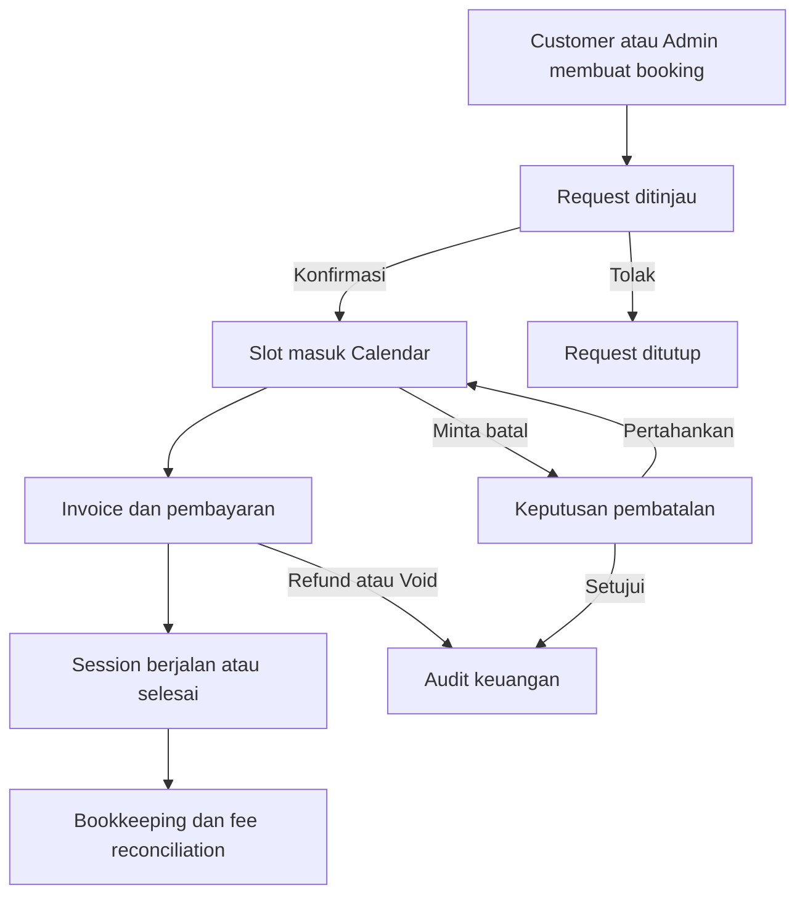

# Product Requirements Document

## 37 Music Studio — Complete Admin Portal UI/UX Overhaul

| Metadata | Nilai |
| --- | --- |
| Versi dokumen | 3.0 |
| Tanggal | 12 Agustus 2026 |
| Status | Final specification — siap menjadi source of truth implementasi |
| Produk | 37 Music Studio Admin Portal |
| Repository | `jangangitungapah-pixel/37studioproper` |
| Baseline kode | `main` — commit `f40e5f2e80c117dfdac6f334a340950c2452827b` |
| Platform | Responsive web app / PWA |
| Bahasa UI utama | Bahasa Indonesia; istilah domain yang sudah dikenal boleh tetap berbahasa Inggris |
| Theme default | Light |
| Mode tambahan | Dark; preferensi System tersedia di Account Settings |
| Pengguna utama | Owner dan Admin 37 Music Studio |

> Dokumen ini menggantikan arah visual parsial sebelumnya untuk cakupan Admin Portal. Business rule yang dinyatakan eksplisit di dokumen ini mengalahkan keputusan visual lama. Kontrak keamanan, histori transaksi, dan isolasi role tidak boleh dilemahkan oleh implementasi UI.

---

## 1. Ringkasan Eksekutif

Admin Portal 37 Music Studio akan menjadi **workspace operasional padat, presisi, hangat, dan cepat** untuk mengelola seluruh siklus bisnis studio: request booking, calendar, customer, invoice dan pembayaran, pembukuan, operator fee, inventory, attendance penjaga, gallery, notification operations, serta konfigurasi sistem.

Desain tidak boleh terasa seperti template dashboard generik. Karakternya adalah **37 Studio OS**: editorial, tactile, warm, quietly premium, dan tetap data-first. Setiap area harus memakai anatomi komponen yang sama, grid yang sama, serta vocabulary status yang sama. Light theme menjadi pengalaman pertama; dark theme adalah kulit kedua dari struktur DOM yang sama.

Desktop harus padat dan produktif: informasi utama terlihat tanpa scrolling panjang, tidak ada hero dekoratif besar, tidak ada kolom kosong tanpa fungsi, dan tabel/ledger menggunakan ruang horizontal secara efektif. Mobile harus ringkas, dapat dipahami dalam sekali lihat, dan sebagian besar tugas harian dapat diselesaikan dengan satu tangan melalui bottom dock, bottom sheet, sticky action, dan target sentuh yang aman.

PRD ini mencakup:

- admin login dan seluruh access state;
- global admin shell desktop dan mobile;
- tiga belas workspace admin yang ada di repository;
- tujuh subpage Settings;
- booking form, booking detail drawer, conversation, invoice, proof review, dan dialog shared lainnya;
- design system, responsive behavior, theme, accessibility, performance, data state, microcopy, analytics, dan quality gate;
- penyesuaian business logic yang diperlukan untuk konsistensi UX, keamanan, dan pencegahan double-posting.

---

## 2. Latar Belakang dan Masalah

### 2.1 Masalah utama

1. **Konsistensi visual belum menyeluruh.** Beberapa page sudah memakai pola spatial workspace, sementara page atau subpage lain masih memiliki anatomi field, card, heading, dan spacing yang berbeda.
2. **Nested surfaces menyebabkan double-box.** Wrapper dan native input sama-sama memiliki border/background sehingga field tampak bertumpuk dan tidak selaras dengan Calendar, Customer, serta booking modal.
3. **Kepadatan tidak konsisten.** Sebagian layar menggunakan terlalu banyak ruang kosong, hero tinggi, card besar, atau preview permanen yang mengurangi jumlah data operasional di atas fold.
4. **Alignment belum memiliki kontrak global.** Judul, command shelf, metric strip, tabel, field, dan sticky action tidak selalu berbagi left edge, baseline, atau control height yang sama.
5. **Theme engine belum memiliki switcher yang terlihat.** Kode sudah mendukung `light`, `dark`, dan `system`, tetapi user belum memiliki kontrol global yang konsisten.
6. **Mobile belum selalu thumb-first.** Tabel, filter, modal, calendar, dan action bar membutuhkan aturan baku agar tidak tertutup bottom navigation atau memaksa jangkauan ke sudut atas.
7. **Status lintas domain mudah tercampur.** Request status, payment status, dan session status harus dipisah secara visual dan logis.
8. **Beberapa operasi sensitif terlalu dekat dengan UI biasa.** Posting pembukuan, review proof, ownership transfer, permanent delete, dan Danger Zone membutuhkan guardrail yang lebih jelas.
9. **Filter dan detail belum selalu dapat dipulihkan.** Refresh/back navigation harus mempertahankan konteks pencarian, filter, selected record, dan Settings area melalui URL atau state yang stabil.

### 2.2 Peluang

- Mengurangi waktu owner/admin untuk menemukan item yang perlu ditindak.
- Membuat pengoperasian dari ponsel tetap aman saat owner berada di luar studio.
- Mengurangi human error pada payment, refund, fee, attendance, dan inventory.
- Mempercepat onboarding admin baru melalui IA, istilah, dan pola interaksi yang konsisten.
- Menjadikan light/dark theme benar-benar setara tanpa menggandakan markup atau style system.

---

## 3. Tujuan Produk

### 3.1 Tujuan utama

1. Menyediakan satu sistem UI/UX yang konsisten untuk seluruh Admin Portal.
2. Menampilkan prioritas operasional dalam kurang dari 5 detik setelah Dashboard dibuka.
3. Memungkinkan tugas harian utama diselesaikan maksimal dalam 3 langkah utama setelah record ditemukan.
4. Memaksimalkan penggunaan viewport desktop tanpa menciptakan kepadatan yang melelahkan.
5. Memungkinkan flow mobile inti diselesaikan dengan satu tangan pada viewport 360–430 px.
6. Menjamin semua aksi keuangan, fee, attendance, akses, dan penghapusan memiliki state, audit trail, serta konfirmasi yang tepat.
7. Menjamin light dan dark theme memiliki struktur, hierarchy, dan keterbacaan yang sama.
8. Menjamin tidak ada elemen penting yang meleset dari grid, terpotong, overlap, atau tersembunyi oleh navigation/keyboard.

### 3.2 Hasil terukur

| Outcome | Target |
| --- | --- |
| Waktu menemukan request yang butuh keputusan | Median ≤ 10 detik dari Dashboard |
| Waktu mencatat pembayaran dari invoice terbuka | Median ≤ 30 detik |
| Waktu approve payment proof yang valid | Median ≤ 25 detik |
| Waktu membuat manual booking lengkap | Median ≤ 90 detik |
| Waktu menemukan customer dan membuka activity | Median ≤ 15 detik |
| Salah posting/double-count dari aksi UI | 0 pada acceptance test |
| Overflow horizontal tidak disengaja | 0 pada viewport uji |
| Elemen interaktif tanpa focus state | 0 |
| Kontras gagal WCAG 2.2 AA | 0 untuk teks dan control penting |
| Layout shift setelah theme/page load | CLS < 0,1 |

---

## 4. Non-Goals

PRD ini tidak bertujuan untuk:

- mengubah Client Portal secara menyeluruh;
- mengubah Guard Portal selain handoff, owner shortcut, dan kontrak attendance yang dikonsumsi Admin Portal;
- mengganti Firebase, Firestore, Cloudinary, atau deployment platform;
- membuat payment gateway otomatis baru;
- membuat sistem payroll penuh;
- menghapus dukungan data booking legacy tanpa migration plan;
- membuat dua set komponen terpisah untuk light dan dark theme;
- menambah visual gimmick, glassmorphism, neon gaming, parallax, atau animasi dekoratif berlebih;
- mengubah Admin Portal menjadi kumpulan card besar dengan informasi tersebar.

---

## 5. Prinsip Pengalaman yang Dikunci

### 5.1 Dense, bukan sesak

- Kepadatan diperoleh melalui hierarchy, grid, typography, dan progressive disclosure.
- Bukan dengan mengecilkan semua teks atau mengurangi target sentuh.
- Desktop menampilkan 7–10 row data pada viewport tinggi 900 px bila data tersedia.
- Mobile menampilkan informasi keputusan terlebih dahulu; metadata sekunder masuk ke expandable detail atau drawer.

### 5.2 Satu workspace, bukan card explosion

- Satu page memiliki satu primary work surface.
- Card hanya digunakan untuk objek yang benar-benar mandiri, dapat dipilih, atau memiliki aksi sendiri.
- Section di dalam editor/form dipisahkan dengan spacing, heading, tonal band, atau separator; bukan selalu nested card.
- Tidak boleh ada bordered card di dalam bordered card tanpa alasan interaksi yang jelas.

### 5.3 Satu anatomi control

- Wrapper control memiliki border, background, radius, focus ring, disabled state, dan error state.
- Native `input`, `textarea`, atau trigger di dalam wrapper transparan dan tanpa border kedua.
- Label, helper, value, icon, error, dan counter mengikuti urutan yang sama di seluruh page.
- `StudioTextField` dan `StudioSelect` menjadi pola rujukan; variasi page tidak boleh membuat primitive baru tanpa kebutuhan domain.

### 5.4 Decision-first

- Item yang memerlukan tindakan muncul sebelum histori dan statistik.
- Primary action selalu menjelaskan hasil: `Konfirmasi Booking`, `Approve & Catat Bayar`, `Post ke Pembukuan`, bukan `Submit` generik.
- Status harus menjawab dua hal: kondisi saat ini dan apa langkah berikutnya.

### 5.5 Aman untuk operasi finansial

- Setiap payment, refund, void, fee posting, dan meal posting bersifat idempotent.
- Histori transaksi tidak dihapus atau ditimpa oleh UI.
- Aksi yang sudah final berubah menjadi read-only audit state.
- UI tidak boleh menampilkan keberhasilan sebelum transaksi canonical selesai.

### 5.6 Mobile thumb-first

- Aksi utama berada di bawah atau tengah layar, bukan hanya di kanan atas.
- Bottom sheet dipakai untuk filter, More menu, dan pilihan kompleks.
- Sticky action bar memperhitungkan safe area, keyboard, dan bottom navigation.
- Destructive action tidak ditempatkan bersebelahan tanpa jarak atau hierarchy yang jelas dengan primary action.

### 5.7 Alignment is a feature

- Semua left edge utama mengikuti grid page.
- Semua control dalam satu row memiliki tinggi dan baseline yang sama.
- Angka uang memakai tabular numerals dan rata kanan pada tabel.
- Icon dan label berada pada optical center, bukan sekadar center matematis bila terlihat timpang.
- Perbedaan posisi lebih dari 1 px pada komponen berulang dianggap defect visual.

---

## 6. Pengguna, Role, dan Akses

### 6.1 Role

| Role | Tujuan | Akses |
| --- | --- | --- |
| Owner | Mengawasi dan mengendalikan seluruh operasi studio | Full access; satu-satunya role untuk Fee Settings, User & Access, ownership transfer, permanent gallery delete, dan Danger Zone |
| Admin | Menjalankan operasi harian | Hanya page yang diaktifkan Owner; tidak dapat membuka area Owner-only |
| Studio Guard | Melakukan attendance | Tidak memiliki menu Admin Portal; selalu diarahkan ke `/guard/attendance` |
| Client | Mengelola aktivitas client | Ditolak dari Admin Portal dan diarahkan ke Client Portal |
| Pending Admin | Menunggu approval Owner | Hanya access state; tidak melihat shell admin |
| Blocked/Rejected | Akses tidak aktif | Hanya access state dan logout |

### 6.2 Kontrak permission

1. Owner selalu memiliki akses penuh dan tidak bergantung pada permission map.
2. Permission `schedule` tetap menjadi compatibility owner untuk Requests, Calendar, dan All Bookings.
3. Permission `settings` memberi akses ke Account, Studio, Pricing, dan Invoice Settings; subpage Owner-only tetap tidak pernah dirender untuk Admin.
4. Permission `notifications` baru boleh ditambahkan untuk memisahkan Notification Console dari Settings. Migration awal mengambil nilai dari permission `settings` agar akses existing tidak hilang.
5. Activity feed notifikasi bersifat in-app, immutable, dan mengikuti permission Notifications.
6. Guard tidak menerima permission Admin Page. `guardPortalPermissionKeys` tetap kosong dan role Guard selalu diisolasi ke Guard Portal.
7. Jika permission page aktif dicabut secara realtime, user diarahkan ke page pertama yang masih diizinkan dan mendapat pesan yang jelas.
8. Owner-only subpage tidak hanya disembunyikan; data query, mutation, route resolution, dan Firestore rule juga harus menolak non-Owner.
9. Sistem tidak boleh menghapus, menonaktifkan, atau memindahkan kepemilikan dari Owner terakhir.
10. Ownership transfer wajib memakai fresh re-authentication dan konfirmasi target yang eksplisit.

### 6.3 Access states

| State | Tampilan wajib | Aksi |
| --- | --- | --- |
| Loading auth | Centered skeleton/loader tanpa flash shell | Tidak ada |
| Belum login | Redirect dengan `redirectTo` yang aman | Login |
| Client salah portal | Penjelasan role, tanpa menyalahkan user | Buka Client Portal; Logout |
| Guard salah portal | Redirect otomatis | Buka Guard Portal |
| Pending approval | Status realtime, email akun, siapa yang perlu dihubungi | Logout |
| Rejected/blocked/invalid | Penjelasan singkat, tanpa data admin | Logout |
| Approved tanpa permission | Penjelasan bahwa Owner belum memberi page access | Logout |
| Session expired | Pesan session berakhir dan return path | Login kembali |
| Offline saat auth cached | Status offline, jangan menjanjikan sinkronisasi | Coba lagi; Logout bila aman |

---

## 7. Information Architecture

### 7.1 Navigasi desktop

| Group | Item | Route canonical | Permission |
| --- | --- | --- | --- |
| Overview | Dashboard | `/admin/dashboard` | `dashboard` |
| Booking | Requests | `/admin/bookings/requests` | `schedule` |
| Booking | Calendar | `/admin/bookings/calendar` | `schedule` |
| Booking | All Bookings | `/admin/bookings` | `schedule` |
| Booking | Customers | `/admin/customers` | `customers` |
| Finance | Invoices & Payments | `/admin/finance/invoices` | `billing` |
| Finance | Bookkeeping | `/admin/finance/bookkeeping` | `bookkeeping` |
| Finance | Operator Fee | `/admin/finance/operator-fees` | `operator-fee` |
| Operations | Inventory | `/admin/operations/inventory` | `inventory` |
| Operations | Guard Attendance | `/admin/operations/guard-attendance` | `guard-attendance` |
| Content | Gallery | `/admin/content/gallery` | `gallery` |
| System | Settings | `/admin/settings` | `settings` |
| System utility | Notifications | `/admin/notifications` | `notifications` atau compatibility `settings` |

Legacy route yang sudah ada tetap redirect ke route canonical tanpa kehilangan query parameter atau hash.

### 7.2 Navigasi mobile

Bottom dock memiliki maksimal lima target:

1. Home
2. Requests
3. Calendar
4. Finance
5. More

`Finance` membuka Invoices & Payments. `More` membuka bottom sheet berisi All Bookings, Customers, Bookkeeping, Operator Fee, Inventory, Guard Attendance, Gallery, Settings, shortcut Notifications, theme control, account identity, dan logout. Item tetap difilter berdasarkan permission.

### 7.3 Settings IA

| Group | Area | Deep link |
| --- | --- | --- |
| Account & Access | Account Settings | `/admin/settings?area=account` |
| Studio Configuration | Studio Settings | `/admin/settings?area=studio` |
| Commerce | Pricing and Session | `/admin/settings?area=pricing` |
| Commerce | Invoice Settings | `/admin/settings?area=invoice` |
| Operations | Fee Settings — Owner-only | `/admin/settings?area=fee-settings` |
| Account & Access | User & Access Settings — Owner-only | `/admin/settings?area=user-settings` |
| System Safety | Danger Zone — Owner-only | `/admin/settings?area=danger` |

Query `area` menjadi source of truth pilihan subpage. Nilai yang tidak diizinkan harus diselesaikan ke subpage pertama yang dapat diakses tanpa menampilkan frame data Owner-only.

---

## 8. Model Domain dan Lifecycle Canonical

### 8.1 Tiga domain status tidak boleh digabung

#### Request Status

| Key | Label UI | Makna |
| --- | --- | --- |
| `draft` | Draft | Belum dikirim client |
| `submitted` | Menunggu Konfirmasi | Menunggu keputusan Admin |
| `confirmed` | Dikonfirmasi | Booking diterima |
| `rejected` | Ditolak | Request tidak diterima |
| `cancellation_requested` | Meminta Pembatalan | Client meminta booking dibatalkan |
| `cancelled` | Dibatalkan | Pembatalan telah diputuskan |

#### Payment Status

| Key | Label UI | Makna |
| --- | --- | --- |
| `unpaid` | Belum Bayar | Net payment nol |
| `partial` | Bayar Sebagian | Net payment lebih dari nol dan kurang dari total |
| `paid` | Lunas | Net payment memenuhi total |
| `refunded` | Refund | Seluruh net payment yang relevan telah dikembalikan |
| `void` | Void | Invoice dibatalkan; payment baru tidak boleh dicatat |

#### Session Status

| Key | Label UI | Makna |
| --- | --- | --- |
| `upcoming` | Akan Datang | Sesi belum dimulai |
| `in_progress` | Berlangsung | Sesi sedang berjalan |
| `completed` | Selesai | Sesi selesai |
| `no_show` | Tidak Hadir | Customer tidak hadir |
| `cancelled` | Dibatalkan | Slot tidak lagi aktif |

### 8.2 Transisi utama



### 8.3 Aturan lifecycle

1. Booking tidak dapat dikonfirmasi tanpa customer, tanggal, jam, layanan, dan durasi yang valid bila layanan memakai durasi.
2. Calendar conflict check dijalankan sebelum save/confirm. Back-to-back diperbolehkan; overlap tidak.
3. Request cancellation tidak otomatis refund. Pembatalan sesi dan keputusan finansial adalah langkah terpisah dengan audit masing-masing.
4. Payment status berasal dari payment/refund ledger, bukan label yang diubah manual tanpa transaksi.
5. Invoice `void` menolak payment baru dan menyimpan alasan, actor, serta timestamp.
6. Session completion tidak otomatis dianggap payment lunas.
7. Posted operator fee dan posted guard meal menjadi immutable di Bookkeeping.
8. Semua mutation finansial mempunyai idempotency key berbasis source record + action agar double click/retry tidak menggandakan ledger.

---

## 9. Global Design System

### 9.1 Arah visual

Nama arah desain: **37 Studio OS — Warm Premium Operational Interface**.

Karakter:

- warm, editorial, precise, tactile;
- quietly premium, tidak mewah berlebihan;
- studio-light amber sebagai accent;
- canvas seperti ruang kerja fisik, bukan kumpulan floating glass cards;
- data-first dengan hierarchy kuat;
- icon line konsisten dari Lucide;
- shadow hanya menjelaskan depth, bukan dekorasi.

Harus dihindari:

- corporate banking dashboard;
- Material/shadcn default look tanpa karakter;
- neon/gaming;
- glassmorphism;
- gradient dekoratif berlebihan;
- card explosion;
- font terlalu kecil untuk mengejar kepadatan;
- uppercase panjang;
- shadow pada setiap container;
- border ganda pada input;
- hero besar dan readiness score yang mendominasi task utama.

### 9.2 Theme dan color tokens

#### Light theme — default

| Token | Nilai awal | Penggunaan |
| --- | --- | --- |
| `--studio-env` | `#F2EEE7` | Background luar workspace |
| `--studio-canvas` | `#FFFDF9` | Primary canvas |
| `--studio-surface-1` | `#FFFAF3` | Surface utama |
| `--studio-surface-2` | `#F8F2E9` | Tonal section/hover |
| `--studio-surface-3` | `#EFE5D7` | Selected/strong tonal |
| `--studio-text-primary` | `#241B15` | Heading/body utama |
| `--studio-text-secondary` | `#5F5145` | Body sekunder |
| `--studio-text-tertiary` | `#7C6E61` | Metadata; harus lolos kontras |
| `--studio-edge-soft` | `rgba(55,39,26,.07)` | Separator halus |
| `--studio-edge-normal` | `rgba(55,39,26,.14)` | Border control/surface |
| `--studio-accent` | `#B56B1B` | Icon, focus, selected accent |
| `--studio-accent-solid` | `#8A4B0D` | Primary button dengan teks putih |
| `--studio-accent-soft` | `rgba(181,107,27,.12)` | Selected background |

#### Dark theme

| Token | Nilai awal | Penggunaan |
| --- | --- | --- |
| `--studio-env` | `#100E0C` | Background luar workspace |
| `--studio-canvas` | `#181512` | Primary canvas |
| `--studio-surface-1` | `#1F1A16` | Surface utama |
| `--studio-surface-2` | `#272019` | Tonal section/hover |
| `--studio-surface-3` | `#312820` | Selected/strong tonal |
| `--studio-text-primary` | `#F8EFE4` | Heading/body utama |
| `--studio-text-secondary` | `#CABCAB` | Body sekunder |
| `--studio-text-tertiary` | `#A19180` | Metadata; harus lolos kontras |
| `--studio-edge-normal` | `rgba(255,244,230,.14)` | Border control/surface |
| `--studio-accent` | `#E29A42` | Icon, focus, selected accent |
| `--studio-accent-solid` | `#D1872E` | Primary action dengan teks gelap |
| `--studio-accent-soft` | `rgba(226,154,66,.14)` | Selected background |

Semantic colors: success hijau, warning amber, danger merah, info biru. Warna bukan satu-satunya pembeda; selalu ada label, icon, atau shape.

### 9.3 Theme switcher

1. First visit selalu `light`, tidak otomatis mengikuti OS.
2. Topbar desktop memiliki icon switcher Light/Dark dengan tooltip dan accessible label.
3. Mobile menyediakan switcher di More sheet bagian account utility; quick toggle boleh muncul di topbar bila lebar aman.
4. Account Settings menyediakan segmented preference `Light`, `Dark`, `System`.
5. Quick toggle hanya berpindah Light ↔ Dark. Pilihan System tetap dapat dipilih dari Settings.
6. Preferensi disimpan lokal segera dan dapat disinkronkan ke profile user.
7. Initial theme diterapkan sebelum React paint agar tidak terjadi flash theme.
8. Struktur DOM, spacing, typography, dan layout identik pada kedua theme.
9. Semua screenshot QA wajib diambil di kedua theme.

### 9.4 Typography

Font utama: Inter dengan system sans fallback. Angka uang dan statistik memakai `font-variant-numeric: tabular-nums`.

| Style | Desktop | Mobile | Weight |
| --- | --- | --- | --- |
| Page title | 24/30 px | 20/26 px | 700 |
| Section title | 16/22 px | 15/21 px | 650–700 |
| Object title | 14/20 px | 14/20 px | 600–650 |
| Body | 13/20 px | 13/19 px | 400–500 |
| Control label | 12/16 px | 12.5/17 px | 600 |
| Metadata | 11.5/16 px | 12/16 px | 500–600 |
| Kicker | 10.5/14 px | 11/15 px | 650; uppercase pendek |

Interactive text tidak boleh lebih kecil dari 12 px. Truncation hanya boleh digunakan bila full value tersedia melalui title/tooltip/detail.

### 9.5 Spacing, radius, dan depth

- Base spacing: 4 px.
- Umum: 4, 8, 12, 16, 20, 24, 32 px.
- Page gap desktop: 16–20 px; mobile: 12–16 px.
- Control radius: 11 px.
- Object radius: 15 px.
- Surface radius: 20–22 px.
- Large overlay radius: 24–28 px desktop; 20–24 px mobile.
- Shadow contact untuk control/floating button; shadow surface hanya pada raised/floating layer.
- Canvas dan inline section tidak diberi shadow.

### 9.6 Layout grid dan density

| Viewport | Shell | Page padding | Grid |
| --- | --- | --- | --- |
| ≥ 1440 px | Rail 240 px / collapsed 72 px | 24 px | 12 kolom, gap 16 px |
| 1180–1439 px | Rail 224 px / collapsed 72 px | 20 px | 12 kolom, gap 16 px |
| 900–1179 px | Rail collapsed 72 px default | 16 px | 8 kolom, gap 12 px |
| < 900 px | Bottom dock | 12 px | 4 kolom, gap 12 px |

Aturan:

- Main workspace mengisi lebar tersedia; tidak memakai max-width kecil yang menyisakan lahan kosong.
- Pada layar > 1920 px, content dapat dibatasi sekitar 1760 px agar scan line tetap sehat, tetapi canvas tetap menyatu dan center alignment jelas.
- Page header maksimal 76 px tinggi desktop dan 64 px mobile, kecuali wrap accessibility.
- Decorative hero maksimal 104 px dan hanya bila memiliki data/action; tidak boleh menjadi banner kosong.
- Primary work surface minimal menggunakan 70% area canvas desktop saat data tersedia.
- Tidak boleh ada empty column; layout beralih menjadi satu kolom jika secondary content tidak ada.

### 9.7 Control dimensions

| Control | Desktop | Mobile |
| --- | --- | --- |
| Standard input/select/button | 38–42 px | minimum 48 px |
| Compact icon button | 36–38 px | minimum hit area 44×44 px |
| Table row | 52–60 px | berubah menjadi object row/card 68–96 px |
| Filter chip | 32–34 px | 36–40 px |
| Bottom dock item | — | minimum 56 px + safe area |

### 9.8 Alignment contract

1. Page context, title, metric strip, command shelf, dan work surface berbagi left/right grid edge.
2. Semua label control dalam row sejajar pada baseline atas.
3. Semua control dalam row memiliki tinggi sama; helper/error menambah tinggi di bawah, bukan menggeser control tetangga secara acak.
4. Numeric columns rata kanan; status dan tanggal memakai lebar stabil bila memungkinkan.
5. Icon leading memiliki slot 18–20 px; jangan mengubah gap per page.
6. Header tabel dan body memakai template column yang sama.
7. Sticky bar, modal footer, dan bottom sheet action menggunakan padding page yang sama.
8. Tidak boleh ada nested margin yang menghasilkan left edge +4/+8 px tanpa alasan hierarchy.
9. Visual QA overlay grid harus menunjukkan deviasi maksimal 1 px pada repeated alignment.

### 9.9 Shared component anatomy

#### Page header

- breadcrumb/context kecil;
- satu `h1` saja;
- description maksimal dua baris dan hanya jika membantu;
- primary action dan utility action di kanan desktop;
- mobile: title kiri, satu icon action atau overflow kanan; primary action utama boleh sticky di bawah.

#### Command shelf

- search selalu elemen terlebar;
- filter di samping desktop;
- result count dan reset state terlihat;
- mobile: search inline, filter membuka bottom sheet, active filters menjadi chips yang dapat dihapus;
- sticky hanya bila list panjang dan tidak menutupi title.

#### Field

- label + optional/required marker;
- satu control surface;
- helper singkat;
- error inline terhubung `aria-describedby`;
- focus ring 2 px dengan offset aman;
- error tidak hanya bergantung pada warna.

#### Table/ledger

- sticky header pada scroll surface panjang;
- zebra tidak wajib; gunakan separator halus;
- hover tidak menjadi satu-satunya tanda klik;
- row utama dapat diklik, action menu tetap terpisah;
- sort state dan filter state dapat dibaca screen reader;
- mobile berubah menjadi object rows, bukan tabel yang dipaksa mengecil.

#### Modal, drawer, dan bottom sheet

- fokus terperangkap dan kembali ke trigger saat ditutup;
- `Escape` bekerja kecuali mutation sedang finalizing;
- scroll hanya pada body overlay; header/footer tetap terlihat;
- background tidak dapat scroll;
- desktop modal form maksimum 760 px; detail drawer 520–640 px;
- mobile menggunakan full-height sheet atau near-full screen, padding safe-area, dan footer sticky;
- tidak boleh berada di belakang bottom dock.

#### Toast dan inline feedback

- Toast untuk hasil singkat; inline alert untuk error yang memerlukan tindakan.
- Maksimal satu toast stack global.
- Success message tidak boleh menggantikan field error.
- Error menyebut apa yang gagal, dampaknya, dan langkah berikutnya.

### 9.10 Motion

- Fast 130 ms, normal 190 ms, slow maksimum 280 ms.
- Motion hanya menjelaskan perubahan state, drawer, sheet, selected plate, atau reordering.
- Tidak ada entrance animation pada setiap card/row.
- `prefers-reduced-motion` menghapus transform dan animation non-esensial.
- Tidak ada layout motion yang menggeser target saat user sedang menekan.

---

## 10. Global Admin Shell

### 10.1 Desktop shell

#### Navigation rail

- Expanded 224–240 px; collapsed 72 px.
- Brand, grouped navigation, active plate, account identity, logout, dan collapse control.
- Collapse state dipersist ke local storage.
- Collapsed state memiliki tooltip untuk semua icon.
- Active page terlihat melalui plate + accent mark + `aria-current`, bukan warna saja.
- Group label tidak mengambil ruang berlebihan.
- Rail dapat scroll sendiri jika tinggi pendek; account footer tetap dapat dijangkau.

#### Topbar

- Context breadcrumb + page title.
- Owner shortcut ke Guard Portal.
- Notification bell dengan badge state `failed`, `processing`, atau `pending`.
- Light/Dark switcher.
- Connectivity/sync chip dengan state `Online`, `Menyinkronkan`, `Offline`, `Error`.
- Logout desktop hanya di rail; tidak diduplikasi di topbar.
- Chip database tidak boleh hanya memakai `navigator.onLine`; state harus mempertimbangkan listener error dan pending write.

#### Workspace

- Topbar dan content berada di satu grid.
- Page scroll dimiliki workspace, bukan body + nested pane sekaligus.
- Skeleton menggantikan struktur data dengan dimensi stabil.
- Route lazy-load tidak menampilkan blank white frame.

### 10.2 Mobile shell

- Compact topbar 52–60 px dengan context/title, notification, dan utility yang benar-benar penting.
- Bottom dock fixed dengan safe-area dan lima target maksimum.
- Page diberi bottom padding minimal tinggi dock + 24 px.
- More menggunakan accessible bottom sheet, bukan popover sempit.
- More sheet dikelompokkan sesuai IA, menampilkan role/account, theme, dan logout.
- Saat keyboard terbuka, bottom dock boleh tersembunyi agar field dan submit action tidak tertutup.
- Saat modal/drawer aktif, bottom dock tidak menjadi layer interaksi di atas overlay.

### 10.3 Responsive behavior

- Tidak ada horizontal page scroll pada 320–899 px.
- Horizontal scroll hanya diperbolehkan pada Calendar grid atau data rail yang diberi affordance jelas.
- Tablet portrait memakai mobile shell; tablet landscape dapat memakai collapsed rail.
- Perubahan breakpoint tidak boleh menghilangkan state filter, selected record, atau unsaved draft.

---

## 11. Cross-Module UX Rules

### 11.1 Search dan filter

- Search debounce 200–300 ms untuk local dataset; server query bila dataset bertambah besar.
- Query, filter, period, sort, page, dan selected record dipersist ke URL.
- `Reset` hanya muncul ketika ada filter non-default.
- Result count selalu memperjelas apakah angka adalah total atau hasil filter.
- Empty state membedakan `belum ada data` dan `tidak ada hasil filter`.

### 11.2 Deep link

- Booking detail: `?bookingId=<id>`.
- Payment proof: `?paymentProofId=<id>`.
- Settings: `?area=<key>`.
- Gallery album/photo: `?view=<view>&album=<id>&photoId=<id>`.
- Notifications dapat membuka destination record dan kembali ke queue tanpa kehilangan filter.
- Deep link yang invalid menampilkan non-blocking message lalu membersihkan parameter, bukan crash.

### 11.3 Realtime dan optimistic UI

- Read-heavy list boleh update realtime.
- Financial, permission, ownership, permanent delete, dan posting tidak memakai optimistic success.
- Low-risk toggle dapat optimistic bila memiliki rollback dan toast error.
- Konflik update menampilkan data terbaru dan pilihan `Muat Ulang` atau `Tinjau Perubahan`.

### 11.4 Unsaved changes

- Account, Studio, Invoice, Pricing, dan Fee Settings menampilkan satu dirty-state indicator per subpage.
- Navigasi keluar saat draft berubah memunculkan confirm dialog.
- Tidak ada dua save bar atau status simpan yang bersaing.
- Save bar desktop menempel pada batas bawah editor; mobile berada di atas bottom dock/safe area.
- Reset draft tidak menghapus konfigurasi aktif sebelum user menekan Save.

### 11.5 Loading, empty, error, offline

Setiap work surface wajib mempunyai:

1. skeleton dengan layout stabil;
2. first-use empty state;
3. filtered empty state;
4. recoverable error state dengan Retry;
5. permission state bila data tidak boleh dibaca;
6. offline/stale badge bila data cache ditampilkan;
7. partial-data warning bila satu source gagal dan source lain berhasil.

---

## 12. Admin Login dan Entry Experience

### 12.1 Tujuan

Memberi entry yang cepat, jelas, dan aman tanpa mencampur Admin, Client, dan Guard.

### 12.2 Desktop

- Split composition maksimal dua kolom: brand/context dan auth surface.
- Auth surface maksimum 440 px; tidak memakai card bertumpuk.
- Login method `Email`, `Google`, dan `Phone OTP` ditampilkan sebagai tab/segmented control yang konsisten.
- Mode sign-in dan sign-up memiliki title, field, serta action yang eksplisit.
- Password visibility memiliki hit area aman dan accessible label.
- Error tetap dekat dengan form; provider error diterjemahkan menjadi pesan yang dapat ditindak.

### 12.3 Mobile

- Single-column, auth surface langsung pada canvas.
- Brand ringkas; form dan CTA berada di thumb zone.
- Keyboard tidak menutupi field aktif atau submit.
- OTP memakai input yang mendukung paste penuh dan numeric keyboard.
- Back dari provider/OTP mempertahankan email/phone yang sudah diisi.

### 12.4 Functional requirements

1. `redirectTo` hanya menerima route internal yang aman.
2. Guard intent langsung diarahkan ke Guard Portal setelah autentikasi.
3. Client yang mencoba Admin Portal melihat wrong-portal state, bukan generic error.
4. Pending Admin mendapat state realtime; tidak dapat melihat skeleton data admin.
5. Google sign-in, email/password, dan phone OTP tidak membuat dua identity document untuk user yang sama.
6. Rate limit, invalid OTP, expired OTP, wrong password, account disabled, offline, dan unauthorized domain memiliki microcopy berbeda.
7. Loading button tidak dapat dipicu dua kali.

### 12.5 Acceptance criteria

- Semua flow dapat dijalankan dengan keyboard.
- Tidak ada password atau OTP yang tersimpan di local storage/log.
- Error tidak menghapus input kecuali alasan keamanan.
- Viewport 320×568 tidak overflow.
- Theme login mengikuti preference tersimpan; first visit light.

---

## 13. Dashboard

**Route:** `/admin/dashboard`

### 13.1 Tujuan

Memberi situational awareness lintas studio dan jalur tercepat menuju item yang perlu keputusan.

### 13.2 Information hierarchy

1. Attention Hub.
2. Jadwal hari ini.
3. Metric operasional.
4. Cashflow period.
5. Quick Studio Health.

### 13.3 Desktop layout

- Row 1: compact Attention Hub penuh lebar, tinggi mengikuti jumlah maksimum empat queue.
- Row 2: Today Timeline 7–8 kolom dan metric strip/quick health 4–5 kolom.
- Row 3: cashflow chart 8 kolom dan Studio Health 4 kolom.
- Bila tidak ada attention, hub menyusut menjadi clear-state strip; tidak meninggalkan hero kosong.
- Chart memiliki period selector `Minggu`, `Bulan`, `Tahun` dan legend yang tidak menghabiskan tinggi.

### 13.4 Mobile layout

- Attention Hub tampil pertama sebagai stacked actionable rows.
- Today Timeline memakai vertical timeline ringkas.
- Metric strip horizontal snap boleh dipakai untuk statistik, tetapi item pertama dan sebagian item kedua harus terlihat sebagai affordance.
- Chart memakai tinggi 220–260 px, touch tooltip, dan tidak memaksa horizontal page scroll.
- Quick Health menjadi compact list; bukan lima card besar.

### 13.5 Data dan aksi

| Object | Isi | Destination |
| --- | --- | --- |
| Request attention | Request baru + cancellation request + unread message | Request Inbox terfilter |
| Billing attention | Outstanding + proof pending | Invoices & Payments terfilter |
| Inventory attention | Low stock + maintenance/broken | Inventory terfilter |
| Today timeline | Jam, customer, service, payment, session | Booking Detail |
| Metric | Sesi aktif, request aktif, outstanding, cash in, net | Module terkait |
| Studio Health | Customer, inventory, income, expense, transaction | Module terkait |

### 13.6 Business rules

- Unscheduled client request tidak dihitung sebagai sesi calendar aktif.
- Angka keuangan menggunakan sumber ledger yang sama dengan Billing/Bookkeeping.
- Partial source failure tetap menampilkan data source lain dengan warning per area.
- Metric tidak boleh menyatukan request, payment, dan session status menjadi satu generic status.

### 13.7 Acceptance criteria

- Item P0 dapat dibuka maksimal satu click/tap dari Attention Hub.
- Above fold desktop 1440×900 menampilkan attention, timeline, dan metric utama.
- Clear state tidak mengambil lebih dari 72 px.
- Tidak ada chart label terpotong pada light/dark.
- Dashboard tetap berguna bila salah satu dari booking, customer, bookkeeping, atau inventory gagal dimuat.

---

## 14. Request Inbox

**Route:** `/admin/bookings/requests`

### 14.1 Tujuan

Menjadi decision queue untuk request booking baru dan cancellation request dari client.

### 14.2 Desktop layout

- Compact overview strip: total actionable, request baru, pembatalan, unread message.
- Command shelf: search, filter `Semua`, `Request Baru`, `Pembatalan`, result count, reset.
- Queue memakai dense rows dengan customer, booking window, service, request status, payment context, unread indicator, dan quick actions.
- Booking Detail Drawer terbuka di kanan tanpa menghilangkan posisi list.

### 14.3 Mobile layout

- Overview menjadi satu summary strip + active filter chips.
- Queue row menjadi actionable object card dengan dua level informasi.
- Primary action berada di sticky footer drawer; quick action pada list dibatasi satu aksi aman dan overflow.
- Filter dibuka dari bottom sheet.

### 14.4 Aksi

#### Submitted request

- `Konfirmasi`
- `Tolak`
- `Buka Detail`

#### Cancellation requested

- `Setujui Batal`
- `Pertahankan Booking`
- `Buka Detail`

### 14.5 Guardrails

1. Konfirmasi menjalankan completeness + conflict validation.
2. Tolak dan setujui pembatalan meminta reason bila policy mengharuskan; reason dikirim ke activity/conversation.
3. `Pertahankan Booking` mengembalikan request state ke confirmed, bukan membuat booking baru.
4. Double tap/action retry tidak mengulang notification atau mutation.
5. Setelah keputusan, row berpindah/keluar dari actionable filter dengan transition singkat dan undo hanya bila domain operation aman.
6. Unread client message ditandai read ketika Messages tab benar-benar terlihat.

### 14.6 Acceptance criteria

- Request paling lama/urgent dapat diurutkan dan terlihat tanpa membuka detail.
- Perubahan realtime tidak menggeser row yang sedang dioperasikan sebelum aksi selesai.
- Tidak ada `Confirm` yang bypass conflict check.
- Search mendukung nama, WA, booking code, dan invoice.
- Empty queue membedakan semua selesai vs filter tidak cocok.

---

## 15. Booking Calendar

**Route:** `/admin/bookings/calendar`

### 15.1 Tujuan

Memberi spatial schedule board untuk membaca occupancy, membuat booking, mengedit booking, dan mendeteksi conflict.

### 15.2 Desktop layout

- Command header ringkas: previous, current range, next, `Hari Ini`, view mode, payment filter, link Request Inbox, `Tambah Booking`.
- View mode: Day, Week, Month.
- Time column sticky pada Day/Week.
- Day headers sticky saat grid vertical scroll.
- Booking block menampilkan customer/project, service, time, payment tone, unread message, dan fee indicator yang relevan.
- Upcoming schedule ledger berada di bawah atau side panel hanya bila tidak mengorbankan lebar calendar.

### 15.3 Mobile layout

- Current period disajikan sebagai context kecil; tidak ada date selector besar yang mendominasi layar.
- Calendar grid dapat horizontal scroll bebas tanpa column snap yang mengganggu.
- Header tanggal memiliki opaque/tonal background agar tidak transparan saat scroll.
- Time column dan selected date context tetap terbaca.
- Gesture horizontal tidak memicu open booking; click/tap dibedakan dari drag dengan movement threshold.
- `Tambah Booking` menggunakan thumb-zone FAB atau sticky CTA, tidak menutupi slot.
- Default mobile view adalah Day atau compact multi-day sesuai preference terakhir; Month digunakan sebagai overview, bukan editor detail.

### 15.4 Conflict dan slot rules

1. Jam operasional mengikuti shared schedule configuration.
2. Booking tanpa durasi studio tidak membentuk blocking interval.
3. Booking cancelled/void yang tidak menggunakan slot disembunyikan dari active grid tetapi tetap tersedia di All Bookings.
4. Back-to-back valid; overlap satu menit atau lebih ditolak.
5. Conflict message menyebut booking yang bentrok, tanggal, dan time range.
6. Current viewport date/range tidak berubah setelah booking disimpan.

### 15.5 Booking Form Modal

Flow empat langkah:

1. **Customer** — nama, project/band, nomor HP; resolve existing customer dan duplicate warning.
2. **Layanan** — package, session type, recording type, pricing context.
3. **Slot** — tanggal, start hour, duration/custom duration; conflict validation.
4. **Bayar** — payment status, method, DP/paid amount, bill summary.

#### Desktop

- Modal 720–760 px, step rail ringkas, form dua kolom maksimum.
- Bill summary tetap terlihat tetapi tidak menjadi card besar.
- Footer: Cancel/Back dan primary Next/Save.

#### Mobile

- Near-full-screen sheet.
- Satu step per layar; step dapat kembali tanpa kehilangan input.
- Native date/time/numeric keyboard digunakan jika lebih efisien.
- Sticky footer berada di atas keyboard/safe area.
- Summary collapsible pada langkah akhir.

#### Form rules

- Nama, HP, date, start time, service, dan valid duration wajib sesuai jenis layanan.
- DP > 0 bila memilih partial/DP.
- Payment amount tidak boleh melebihi total.
- Initial payment membuat payment history canonical satu kali.
- Pricing snapshot tersimpan pada booking agar perubahan Settings masa depan tidak mengubah invoice historis.
- Unsaved draft warning muncul saat modal ditutup.

### 15.6 Acceptance criteria

- Horizontal scroll mobile halus dan tidak tersangkut snap.
- Booking block tidak tertutup sticky header.
- Tidak ada column header transparan.
- Semua control modal mobile minimum 48 px.
- Save failure mempertahankan form data.
- Calendar, Upcoming list, dan Client Calendar mirror konsisten setelah save.

---

## 16. All Bookings

**Route:** `/admin/bookings`

### 16.1 Tujuan

Menjadi global booking index untuk mencari setiap booking lintas waktu dan status.

### 16.2 Desktop layout

- Compact metric strip: total result, upcoming, payment attention, actionable request.
- Command shelf: universal search + tiga filter domain Request, Payment, Session.
- Dense table/ledger: booking code, customer, schedule/service, request, payment, session, total/outstanding, source, action.
- Header sticky dan numeric columns rata kanan.
- Booking Detail Drawer membuka record tanpa route context hilang.

### 16.3 Mobile layout

- Search selalu terlihat.
- Tiga domain filter berada dalam bottom sheet; active status muncul sebagai removable chips.
- Object row menampilkan booking code/customer, date/time, tiga compact status chips, serta total/outstanding.
- Tap row membuka full-height detail sheet.

### 16.4 Booking Detail Drawer

Tabs:

- Overview
- Messages
- Payment
- Activity

Overview berisi customer, contact action, service, slot, price summary, dan ketiga status domain. Messages menggunakan Booking Conversation. Payment menampilkan immutable payment/refund history dan action yang sesuai permission. Activity menampilkan chronological audit.

### 16.5 Requirements

1. Filter tiga domain tidak saling menggantikan.
2. Search mendukung customer, WA, booking ID/code, invoice, band/project.
3. Sort default berdasarkan schedule/update terbaru dengan aturan stabil.
4. Source `Client` dan `Admin` terlihat tetapi tidak mendominasi row.
5. Drawer deep link menggunakan `bookingId`.
6. Contact action menggunakan data normalized; value asli tetap tersedia di detail.

### 16.6 Acceptance criteria

- Kombinasi filter dapat dibagikan melalui URL.
- Back dari drawer mempertahankan scroll dan filter.
- Tiga status tetap terbaca pada viewport 360 px tanpa horizontal page scroll.
- Activity tidak mengarang event dari timestamp yang tidak ada.

---

## 17. Customers

**Route:** `/admin/customers`

### 17.1 Tujuan

Menjadi relationship workspace: directory, profil, booking activity, outstanding, follow-up, dan duplicate resolution.

### 17.2 Desktop layout

- Directory header ringkas dengan total customer, active/VIP, outstanding, follow-up.
- Command shelf: search, customer filter, add customer.
- Primary directory table/list 7–10 rows above fold.
- Detail memakai split view atau in-page profile dengan back state, tidak membuat header kedua yang besar.
- Follow-up Center menjadi secondary panel yang dapat collapse; tidak selalu memakan setengah canvas.

### 17.3 Mobile layout

- Search + filter button + add action.
- Customer rows menampilkan name, WA, relationship/status, last activity, dan outstanding.
- Customer detail full-screen: compact identity header, WhatsApp/Call actions di thumb zone, activity timeline, follow-up.
- Add/Edit Customer menggunakan bottom sheet/full-screen form.

### 17.4 Directory filters

- Semua
- Pending/DP
- Sudah Lunas
- Recording
- Latihan
- Nomor Ganda
- Normal
- VIP/Loyal
- Perlu Follow-up
- Lama Tidak Booking

Filter yang terlalu banyak dikelompokkan di sheet; command shelf tidak menjadi bar penuh chip.

### 17.5 Customer detail

- Identity: name, phone, email, Instagram, band/project.
- Relationship: status, note, follow-up flag.
- Commercial summary: total bookings, paid, outstanding, latest activity.
- Activity timeline: rehearsal/recording/payment status dengan month grouping.
- Actions: WhatsApp, Call, Edit, Follow-up template, Merge duplicate.

### 17.6 Business rules

1. Phone normalized menjadi primary duplicate key, tetapi nomor asli tetap ditampilkan sesuai format manusia.
2. Create/edit memperingatkan duplicate sebelum save.
3. Merge memindahkan referensi booking secara transactional, mempertahankan audit source, dan tidak menghapus histori.
4. Follow-up message memakai Studio Settings untuk studio name/contact.
5. Outstanding berasal dari ledger booking, bukan field manual customer.
6. Manual customer tetap dapat digunakan saat booking source gagal, dengan partial-data warning.

### 17.7 Acceptance criteria

- Tidak ada field customer yang memiliki double border.
- Directory/detail berbagi typography dan control anatomy yang sama.
- Merge meminta target/source yang eksplisit dan menampilkan dampak jumlah booking.
- WhatsApp link tidak dibuat dari phone invalid.
- Activity filter dan expanded row tidak hilang saat data realtime update.

---

## 18. Invoices & Payments

**Route:** `/admin/finance/invoices`

### 18.1 Tujuan

Menjadi finance command center untuk invoice, payment collection, payment proof, reminder, refund, void, print, share, dan audit.

### 18.2 Desktop layout

1. Compact Finance Pulse: outstanding, received, refund, proof pending.
2. Cash summary + period selector.
3. Command shelf: search, invoice status, cash period/filter bila relevan.
4. Payment Proof queue ringkas di atas ledger bila ada pending; collapse ke summary bila clear.
5. Reminder queue sebagai compact priority list, bukan card besar.
6. Invoice/payment ledger sebagai primary surface.

### 18.3 Mobile layout

- Finance Pulse menjadi 2×2 compact metric grid.
- Priority proof/reminder muncul sebelum ledger.
- Search inline; status/period di bottom sheet.
- Invoice object row menampilkan customer, invoice, date, payment state, total, paid, outstanding.
- Invoice detail/review/payment/refund/void memakai full-height sheet dengan sticky actions.

### 18.4 Invoice states dan filter

- Semua
- Belum Bayar
- Sebagian/DP
- Lunas
- Void
- Ada Refund
- Refund Penuh

`Ada Refund` dapat menjadi derived filter dari refund history; tidak harus menjadi canonical status baru.

### 18.5 Payment Proof Command Center

#### Queue

- Search customer, invoice, booking ID.
- Filter Semua, Menunggu Review, Approved, Rejected.
- Pending memperlihatkan `Review sekarang`.
- Reviewed memperlihatkan `Lihat audit` dan read-only state.
- Deep link `paymentProofId` membuka proof yang tepat.

#### Review

- Preview file dengan fallback download/open.
- Customer, booking, invoice, submitted amount/category/method, timestamp.
- Approved/rejected actor dan timestamp untuk history.
- Pending actions: `Approve & Catat Bayar` dan `Reject`.
- Reject meminta reason; client boleh re-upload.
- Approve meminta amount/method confirmation, tidak menyalin nilai buta bila melebihi outstanding.

#### Canonical write rule

- Approval memanggil satu payment-accounting service canonical.
- Dalam satu atomic/idempotent operation: proof reviewed, payment history ditambah, booking payment status dihitung ulang, bookkeeping source event dibuat/diperbarui satu kali, reviewer audit disimpan.
- Reviewed proof immutable dari UI.
- Retry tidak pernah membuat payment kedua.

### 18.6 Manual payment

- Amount > 0 dan ≤ outstanding.
- Method: Cash, Transfer, QRIS, Lainnya.
- Optional note.
- Preview resulting paid/outstanding/status sebelum confirm.
- Success baru ditampilkan setelah canonical write berhasil.

### 18.7 Refund

- Maximum refundable menggunakan net paid yang belum direfund.
- Reason minimal empat karakter dan wajib.
- Partial/full result dipreview.
- Refund membuat negative ledger event, tidak menghapus payment asli.
- Refund tidak otomatis mengaktifkan slot yang sudah dibatalkan.

### 18.8 Void

- Reason wajib.
- Void tidak boleh digunakan sebagai shortcut refund.
- Jika payment sudah ada, UI menjelaskan konsekuensi dan mengarahkan ke refund sesuai policy sebelum/bersamaan dengan void.
- Invoice void read-only untuk payment baru.

### 18.9 Invoice preview/print/share

- Digital preview menggunakan Studio Settings untuk identity/payment info dan Invoice Settings untuk subtitle/footer/paper size/prefix.
- Thermal 80 mm dan 58 mm teruji.
- Print CSS boleh memakai `!important` hanya dalam scoped print layer.
- Share text menampilkan invoice, booking, customer, date/time, total, paid, outstanding, dan payment instruction yang masih berlaku.
- WhatsApp reminder memakai normalized phone dan Studio Settings.

### 18.10 Acceptance criteria

- Payment approval tidak dapat double-post dalam test retry/double click.
- Refund/void selalu mempunyai audit actor, reason, timestamp.
- Proof reviewed benar-benar read-only.
- Finance total sama dengan sumber Bookkeeping untuk period yang sama.
- Mobile 360 px menampilkan nominal tanpa potongan ambigu.
- Print preview tidak membawa navigation/sidebar.

---

## 19. Bookkeeping

**Route:** `/admin/finance/bookkeeping`

### 19.1 Tujuan

Menjadi ledger cashflow dan reconciliation surface untuk booking payment, refund, operator fee, guard meal, serta transaksi manual.

### 19.2 Desktop layout

- Summary strip: Cash Masuk, Pengeluaran, Saldo Bersih, Piutang.
- Command shelf: period, search, transaction type, export, add transaction.
- Ledger grouped by date dengan source badge, method, amount, note, dan action.
- Auto/reconciliation source tampil locked; manual source dapat edit/delete.

### 19.3 Mobile layout

- Summary 2×2 compact grid.
- Search + filter sheet.
- Date group sebagai sticky/subtle section header.
- Transaction row: type icon, title/source, method/date, amount, action overflow.
- Add/Edit form full-height sheet dengan numeric keyboard.

### 19.4 Data sources

| Source | Type | Editability |
| --- | --- | --- |
| Booking payment | Income | Read-only |
| Booking refund | Expense/negative income | Read-only |
| Operator fee | Expense | Read-only setelah posted |
| Guard attendance meal | Expense | Read-only setelah posted |
| Reconciliation/system | Sesuai source | Read-only |
| Manual | Income/expense | Editable dengan audit |

### 19.5 Manual transaction

- Type: Pemasukan/Pengeluaran.
- Categories disesuaikan type: Maintenance, Operasional, Inventory, Crew, Promosi, Sewa, Sewa Alat, Retail, Service, Lainnya.
- Date, title, amount, method wajib sesuai rules.
- Delete memakai confirm dan soft/audit delete bila data model memungkinkan.

### 19.6 Export XLSX

- Mengikuti filter aktif.
- Memiliki sheet Ringkasan, Transaksi, dan Piutang.
- Currency/date formatting benar.
- Filename berisi period + timestamp.
- Export progress dan failure tidak membekukan page.

### 19.7 Acceptance criteria

- Angka summary sama dengan ledger filtered.
- Auto transaction tidak memiliki Edit/Delete.
- Search mendukung title, note, method, source, booking/customer reference.
- Export row count dan summary tervalidasi oleh automated test.
- Piutang tidak dihitung sebagai cash masuk.

---

## 20. Operator Fee

**Route:** `/admin/finance/operator-fees`

### 20.1 Tujuan

Menjadi reconciliation workflow dari booking → crew assignment → fee estimate → review → posting Bookkeeping, termasuk uang makan penjaga dari attendance.

### 20.2 Desktop layout

- Pulse strip: estimated total, need assignment, need review, ready post, posted.
- Period/status command shelf + search.
- Bulk action bar hanya muncul saat selection valid.
- Fee ledger menunjukkan booking, service/duration, Guard/Operator assignment, rule lines, eligibility, total, status, dan primary action.
- Guard Meal panel berada sebagai section kedua setelah booking fee, bukan card kompetitor di samping ledger utama.

### 20.3 Mobile layout

- Queue summary compact.
- Filter bottom sheet.
- Booking fee object row menampilkan missing requirement pertama dan primary next action.
- Assignment memakai searchable bottom sheet.
- Rule breakdown collapsible.
- Bulk action tidak disembunyikan; sticky selection bar di atas bottom dock.

### 20.4 Lifecycle

1. **Estimate** — rule cocok, belum lengkap/review.
2. **Draft** — assignment/payload tersimpan.
3. **Reviewed / Siap Post** — owner/admin yang berizin telah meninjau.
4. **Posted** — expense entry canonical ada di Bookkeeping.
5. **Void/Superseded** — duplicate/legacy row tidak aktif tetapi audit tetap ada.

### 20.5 Rules

- Assignment wajib sebelum review.
- Guard fee yang memerlukan attendance hanya eligible setelah attendance approved pada tanggal booking.
- Custom rule dan default rule tidak boleh menghasilkan duplicate canonical line untuk target yang sama.
- Duplicate posted detection memblokir posting.
- Fee posted immutable; correction memakai reversal/void + replacement, bukan edit silent.
- Bulk review/post hanya memproses row eligible dan memberi report success/skipped/error.
- Posted source memakai unique key booking + rule + payee + lifecycle version.

### 20.6 Guard Meal

- State: Menunggu Selesai Jaga, Siap Post, Posted.
- Hanya attendance approved dan shift selesai yang eligible.
- Satu guard per tanggal/rule tidak boleh mendapat meal duplicate.
- Post individual dan bulk memakai idempotency.

### 20.7 Acceptance criteria

- UI selalu menjelaskan blocker pertama: Assign, Attendance, No Rule, Review, atau Duplicate.
- Posted count dan expense Bookkeeping sama.
- Deactivated crew/rule tetap dapat dibaca pada histori.
- Bulk result memberi daftar skipped/error, bukan toast angka saja.

---

## 21. Inventory

**Route:** `/admin/operations/inventory`

### 21.1 Tujuan

Mengelola equipment registry, consumable stock, condition, maintenance attention, dan movement history.

### 21.2 Desktop layout

- Summary strip: total active, low stock, maintenance/broken, inactive.
- Command shelf: search, category, status, export CSV, add item.
- Attention panel ringkas hanya saat ada item bermasalah.
- Primary equipment ledger menunjukkan item/category, condition/location, stock/minimum/unit, status, quick adjust, edit/archive.
- Recent movement dapat menjadi collapsible side/secondary section.

### 21.3 Mobile layout

- Search + filter + add.
- Equipment object row menampilkan item, condition/status, location, stock/min.
- Quick `−` dan `+` memiliki hit area aman dan confirmation summary untuk perubahan besar.
- Adjustment dan form memakai bottom sheet/full-screen.

### 21.4 Data dan actions

- Category: Alat Studio, Kabel, Drum, Gitar/Bass, Recording, Aksesoris, Consumable, Lainnya.
- Type: Asset/Consumable.
- Condition: Baik, Cukup, Maintenance, Rusak.
- Status: Aktif, Maintenance, Rusak, Hilang, Nonaktif.
- Action: create, edit metadata, stock in, stock out, archive/deactivate, export.

### 21.5 Business rules

1. Stock tidak boleh negatif kecuali explicit inventory correction permission dan reason.
2. Setiap adjustment membuat immutable movement dengan actor, timestamp, before, delta, after, reason.
3. Archive tidak menghapus movement history.
4. Low stock derived dari quantity < minStock.
5. Broken/lost/inactive status tidak otomatis mengubah quantity tanpa action terpisah.
6. CSV mengikuti filter aktif dan melakukan escaping yang benar.

### 21.6 Acceptance criteria

- Quick adjust tidak dapat double-apply karena double tap.
- Current quantity sama dengan latest movement result.
- Long item/note tidak merusak grid.
- Status, condition, dan stock attention tidak hanya dibedakan warna.
- Filter/scroll state dipertahankan setelah edit.

---

## 22. Guard Attendance — Admin Review

**Route:** `/admin/operations/guard-attendance`

### 22.1 Tujuan

Memberi Owner/Admin review queue untuk attendance penjaga, menentukan eligibility fee, dan memantau meal reconciliation.

### 22.2 Desktop layout

- Priority context strip: waiting decisions vs all clear.
- Summary: perlu review, approved today, completed eligible, meal posted.
- Command shelf: search, date, review status.
- Review ledger: guard identity, date, start/end, duration, shift status, review status, note, meal state, action.

### 22.3 Mobile layout

- Priority queue first.
- Attendance object row menampilkan guard, date/time, duration, shift/review/meal state.
- Swipe action tidak digunakan untuk approve/reject; tap membuka decision sheet.
- Approve/reject/void action sticky dan berjarak aman.

### 22.4 Actions

- Approve.
- Reject dengan reason.
- Void approved record dengan reason dan elevated confirmation.
- Open audit/detail.

### 22.5 Rules

1. Shift aktif/belum selesai tidak dapat approved sebagai completed attendance.
2. Approve mengaktifkan eligibility canonical; tidak langsung membuat duplicate fee.
3. Reject dan Void wajib reason.
4. Meal state berasal dari reconciliation record, bukan toggle manual.
5. Attendance yang sudah menghasilkan posted fee/meal tidak dapat diubah tanpa reversal workflow.
6. Owner approval modal global hanya menampilkan pending yang benar-benar actionable dan dapat didismiss untuk session tanpa menandai reviewed.

### 22.6 Acceptance criteria

- Review status dan shift status selalu tampil sebagai dua state berbeda.
- Action blocked menjelaskan blocker.
- Date/search/filter dapat dipulihkan lewat URL.
- Approve/reject/void update Operator Fee secara konsisten.

---

## 23. Gallery

**Route:** `/admin/content/gallery`

### 23.1 Tujuan

Menjadi media library studio untuk upload, organization, favorite, album, metadata, lightbox, edit, slideshow, trash, dan recovery.

### 23.2 Views

- Photos
- Albums
- Trash
- Album detail
- Photo/lightbox detail

### 23.3 Desktop layout

- Compact gallery overview: total photo, favorite, album, trash.
- Command shelf: search, view switch, density, select, upload.
- Responsive photo grid dengan density comfortable/compact.
- Selection menampilkan batch bar yang tidak menutup row terakhir.
- Lightbox memakai full viewport, image center, utility toolbar, dan collapsible info/editor panel.

### 23.4 Mobile layout

- Two-column photo grid default; single-column hanya untuk accessibility/large text.
- Search dan view switch tetap ringkas.
- Upload menggunakan full-screen sheet.
- Lightbox gesture mendukung next/previous; destructive action masuk overflow/detail, bukan tombol besar dekat close.
- Editor controls menjadi bottom sheet bertahap.

### 23.5 Capabilities

- Upload image maksimal 12 MB dengan title, description, category, album/context.
- Search title, description, category, uploader.
- Favorite individual/bulk.
- Select all/cancel selection.
- Soft delete, restore, permanent delete.
- Metadata edit.
- Albums: all, favorites, latest, category albums.
- Lightbox: info, keyboard shortcuts, slideshow, optional ambient music, image adjustments/filter.
- Save edited image as new copy; download edited result.

### 23.6 Business and safety rules

1. Soft delete tersedia untuk Gallery Admin; permanent delete dan Empty Trash Owner-only.
2. Confirmation menyebut jumlah item dan bahwa external Cloudinary file mungkin memerlukan lifecycle terpisah.
3. Edit selalu menyimpan copy baru secara default; original tetap ada.
4. Metadata update tidak men-upload ulang binary.
5. Album derived dari category tidak membuat duplicate media document.
6. Keyboard shortcut dinonaktifkan saat focus berada di input/textarea.
7. Slideshow/music menghormati reduced motion dan user-initiated audio policy.

### 23.7 Acceptance criteria

- Grid tidak berubah tinggi liar saat image load; aspect-ratio placeholder wajib.
- Batch action melaporkan partial failure per file.
- Escape/close mengembalikan focus dan scroll position.
- Trash view membedakan soft deleted dan permanent action.
- Dark lightbox tetap konsisten dengan Admin theme tanpa memaksa seluruh page dark.

---

## 24. Notification Console

**Route:** `/admin/notifications`

### 24.1 Tujuan

Memantau readiness, queue, failure, processing, dan destination notification tanpa menjadikan browser tempat menyimpan backend secret.

### 24.2 Desktop layout

- Operational summary strip: failed, pending, processing, high priority.
- Ringkasan activity feed: total, booking, pembayaran, dan aktivitas prioritas.
- Command shelf: status filter, search bila dataset mendukung, refresh health.
- Queue ledger: event type, message summary, target, created/updated time, status, attention, destination, action.

### 24.3 Mobile layout

- Failed/pending first.
- Readiness collapsible; failure item tetap terbuka.
- Event rows menjadi object cards.
- Retry/cancel/visit destination berada di detail sheet.

### 24.4 Business logic change — required

1. Worker secret tidak boleh ditempel atau dikirim dari browser.
2. Worker URL dan secret berpindah ke protected server configuration/environment.
3. UI memanggil authenticated backend action/callable endpoint.
4. Admin dengan notification read permission boleh melihat queue dan destination.
5. Owner atau permission operasi khusus boleh retry/cancel/process.
6. Manual dry-run memakai server-side authorization dan audit actor.
7. Retry menggunakan event idempotency; sent event tidak dikirim ulang tanpa explicit elevated confirmation.

### 24.5 Event actions

- Open booking/payment/attendance destination.
- Retry failed event.
- Cancel pending event.
- Select valid pending/failed events untuk process sesuai permission.
- Refresh health.

### 24.6 Acceptance criteria

- Tidak ada secret di DOM, state persisted, network log client, atau bundle.
- Badge topbar sinkron dengan failed > processing > pending priority.
- Queue empty dan queue healthy adalah state berbeda.
- Destination back navigation mempertahankan filter/selection.
- Health check timeout tidak membekukan queue.

---

## 25. Settings Workspace

**Route:** `/admin/settings?area=<key>`

### 25.1 Tujuan

Menjadi control room konfigurasi yang konsisten dengan Calendar, Customers, dan booking modal: padat, tenang, mudah dipindai, tanpa nested card/double-box, dan aman terhadap unsaved changes.

### 25.2 Global Settings layout

#### Desktop

- Shell topbar sudah menampilkan `Settings`; content tidak mengulang hero `Settings` besar.
- Grid maksimum dua kolom: Settings Map 216–240 px dan editor fleksibel.
- Settings Map memuat group label, area label, selected state, dan Owner-only marker bila relevan.
- Current context di editor maksimum 60 px: group, title, description satu baris/dua baris pendek.
- Editor memakai satu primary surface; section dipisah spacing 20–24 px dan separator.
- Sticky save bar hanya muncul pada subpage dengan draft dan berada di bawah editor, bukan overlay di tengah content.

#### Mobile

- Settings Map berubah menjadi `Settings Area` select atau top-level bottom sheet.
- Current area title ringkas, tidak ada hero duplikat.
- Semua form satu kolom.
- Sticky save bar berada di atas bottom dock/safe area.
- Navigasi area mempertahankan draft dan memperingatkan sebelum meninggalkan subpage dirty.

### 25.3 Settings component rules

1. Maksimal dua field columns desktop; field panjang seperti address/terms selalu full width.
2. Semua field memakai shared wrapper; native input/textarea transparan dan tanpa border kedua.
3. Optional/Required diletakkan pada label helper, bukan placeholder.
4. Satu subpage memiliki satu save status.
5. Tidak ada permanent preview panel jika preview tidak dibutuhkan untuk mengambil keputusan.
6. Readiness percentage tidak digunakan sebagai hero. Missing required field cukup terlihat melalui validation summary dan field state.
7. Save mempertahankan ordering list seperti payment terms, pricing item, dan fee rule.
8. Form server error tidak menghapus draft.

### 25.4 Account Settings

**Area:** `account`

#### Scope

- Account identity summary: display name, email, UID copy, role, approval status, provider.
- Profile edit.
- Password security.
- Preferences: default landing page, preferred contact, notification level, account note, theme preference.

#### Desktop layout

- Compact account identity strip, bukan hero besar.
- Section 1 `Profil`: display name dan immutable email/UID context.
- Section 2 `Keamanan Login`: provider state, current/new/confirm password, Google re-auth path, password reset.
- Section 3 `Preferensi`: landing page, contact, notification, theme, note.
- Maksimal dua kolom; password section boleh tiga field hanya pada lebar ≥ 1280 px dan tetap memiliki label sejajar.

#### Mobile

- Identity strip maksimal dua baris.
- Security form satu kolom.
- Provider explanation collapsible bila panjang.
- Save Profile dan Save Preferences adalah action per section; tidak boleh saling mengklaim draft.

#### Rules

1. Display name 2–60 karakter.
2. Password minimal 6 karakter mengikuti Firebase existing requirement; strength indicator memberi guidance, bukan mengubah rule diam-diam.
3. Current password hanya untuk re-auth dan tidak pernah disimpan.
4. Google re-auth menambahkan/mengubah password pada UID yang sama.
5. UID copy tidak mengekspos token atau secret.
6. Default landing hanya menampilkan page yang user boleh akses.
7. First theme tetap Light; user dapat memilih Light/Dark/System.

#### Acceptance criteria

- Tidak ada duplicate header `Account Settings` besar.
- Provider state dan next action dipahami tanpa membaca paragraf panjang.
- Save status Profile dan Preferences tidak tertukar.
- Non-Owner tidak melihat control Owner/access management di subpage ini.

### 25.5 Studio Settings

**Area:** `studio`

#### Scope

- Identity: studio name.
- Public contact: phone/WhatsApp dan address.
- Bank transfer: bank name, account number, account holder.
- QRIS: label dan note.
- Payment terms: ordered list, minimal 1, maksimal 12.

#### Layout yang dikunci

- Hapus redundant hero, persistent live preview, readiness percentage, dan card-heavy composition.
- Gunakan satu editor surface dengan section:
  1. Identitas & Kontak
  2. Pembayaran
  3. Ketentuan Pembayaran
- Desktop maksimal dua columns; rekening/QRIS dapat memakai dua columns.
- Address dan payment terms full width.
- Mobile satu column, control minimum 48 px.
- Bank preview hanya inline summary tepat di bawah bank fields: `Bank • nomor terformat • a.n. pemilik`.
- Satu safe sticky save bar dengan dirty/saving/saved/error state.

#### Validation

- Studio name required.
- Phone 9–15 digit normalized.
- Bank name required.
- Account number minimum 6 digit.
- Account holder required.
- QRIS label required; note optional sesuai policy, tetapi UI harus konsisten dengan schema.
- Payment terms minimal satu non-empty, maksimal 12.
- Reorder payment terms dengan handle keyboard-accessible; urutan disimpan.

#### Source-of-truth rule

Studio Settings adalah source of truth untuk nama, alamat, phone/WhatsApp, bank, account holder, QRIS, dan payment terms. Billing, Client Portal, reminder, invoice, dan share message mengonsumsi settings ini. Tidak ada duplicate identity edit di Invoice Settings.

#### Draft actions

- `Batalkan Perubahan` mengembalikan saved snapshot.
- `Muat Default` hanya mengisi draft.
- `Simpan Studio Settings` melakukan validation lalu write.
- Navigasi keluar saat dirty meminta konfirmasi.

#### Acceptance criteria

- Field terlihat identik dengan Customer dan Booking Modal primitives.
- Tidak ada double border/background.
- Above fold desktop menampilkan identity, contact, dan sebagian payment tanpa hero tinggi.
- Mobile sticky bar tidak tertutup dock/keyboard.
- Save failure mempertahankan semua field dan ordering terms.

### 25.6 Pricing and Session

**Area:** `pricing`

#### Objects

- Session List.
- Discounts.
- Recording Types.
- Packages.

#### Desktop

- Section menggunakan dense editable rows dengan title, description/context, price/duration, status/action.
- Add/Edit membuka side sheet atau inline editor yang tidak mendorong seluruh page secara liar.
- Satu object type per section; section dapat collapse tetapi state tersimpan selama session.

#### Mobile

- Object rows dengan edit/delete overflow.
- Add/Edit full-height sheet satu kolom.
- Currency input mendukung format Rupiah tanpa mengubah caret secara membingungkan.

#### Rules

1. Locked/default sessions tidak dapat dihapus jika menjadi compatibility dependency.
2. Recording session price/duration mengikuti selected Recording Type.
3. Package dapat memiliki optional studio duration; package tanpa studio tidak memblok Calendar.
4. Discount memiliki duration dan target session yang jelas.
5. Setiap booking menyimpan pricing snapshot.
6. Delete object yang sudah dipakai booking menjadi deactivate/archive, bukan hard delete.
7. Pricing save tidak memakai silent auto-save yang tidak terlihat. Gunakan explicit save atau per-row save dengan state yang jelas dan audit.

#### Acceptance criteria

- Tidak ada row action yang bergeser karena angka panjang.
- Dependency warning muncul sebelum deactivate/delete.
- Currency dan duration tervalidasi sebelum save.
- Light/dark memakai struktur yang sama.

### 25.7 Invoice Settings

**Area:** `invoice`

#### Scope

- Subtitle invoice.
- Footer.
- Invoice prefix.
- Starting number.
- Tax enabled dan percentage.
- Thermal paper size 80 mm / 58 mm.
- Terms/conditions khusus dokumen invoice bila berbeda dari Studio payment terms.

#### Required logic cleanup

- Nama studio, phone, dan address tidak diedit ulang di sini.
- Tampilkan read-only compact identity reference dari Studio Settings dengan link `Edit di Studio Settings`.
- Invoice preview ringkas dan on-demand; tidak perlu selalu menjadi kolom permanen.
- Prefix/starting number mutation yang dapat menyebabkan collision membutuhkan validation terhadap invoice existing.

#### Rules

1. Tax percentage aktif hanya jika `taxEnabled`.
2. Invoice number generation atomic dan collision-safe.
3. Perubahan prefix/starting number berlaku untuk invoice baru, tidak mengubah historical invoice number.
4. Paper preview menggunakan real sample data tanpa menulis data.
5. Reset default hanya mengubah draft sampai Save.

#### Acceptance criteria

- Tidak ada duplicate identity field.
- Print sample 58/80 mm tidak terpotong.
- Prefix collision diblokir dengan penjelasan.
- Preview dapat dibuka/ditutup tanpa mengubah draft.

### 25.8 Fee Settings — Owner-only

**Area:** `fee-settings`

#### Scope

- Crew registry.
- Crew role: Guard, Operator, Both.
- Default payment method.
- Rule target booking/session/recording/package.
- Payee role.
- Calculation: Flat, Per Jam, Per Block.
- Amount.
- Guard meal daily amount.

#### Desktop

- Section `Rules`, `Guard Meal`, dan `Crew` dalam satu editor surface.
- Rule list dense, ordered, dan menunjukkan active/inactive.
- Add rule menggunakan structured builder, bukan row dengan terlalu banyak field kecil.
- Crew list menunjukkan histori-safe deactivation.

#### Mobile

- Rule object rows; edit via full-height sheet.
- Target selection searchable.
- Save bar sticky dan satu saja.

#### Rules

1. Deactivate, jangan hard delete, untuk rule/crew yang sudah memiliki histori.
2. Custom rule harus memiliki target dan nominal valid.
3. Ordering rule deterministik; bila lebih dari satu match, policy resolution terlihat.
4. Per Block menjelaskan base hours dan rounding.
5. Rule preview menunjukkan contoh perhitungan sebelum Save.
6. Hanya Owner dapat read/write area ini.

#### Acceptance criteria

- Non-Owner tidak memuat data Fee Settings.
- Rule yang inactive tetap terbaca pada audit lama.
- Preview calculation sama dengan Operator Fee page.
- Reorder/activate/deactivate tidak kehilangan dirty state.

### 25.9 User & Access Settings — Owner-only

**Area:** `user-settings`

#### Scope

- Owner-managed account provisioning.
- Pending approval.
- User list.
- Role Admin/Guard.
- Guard identity linker.
- Page permissions.
- Activate/deactivate.
- Ownership transfer.
- Permanent user document delete sesuai policy.

#### Desktop

- Section 1 `Buat Akun Portal`: compact form maksimal dua columns.
- Section 2 `Pending Approval`: hanya muncul jika ada data.
- Section 3 `Akun Portal`: dense user list dengan identity, role, status, guard link, permission count, actions.
- Permission editor menggunakan drawer/sheet; bukan card inline yang memperpanjang setiap row.

#### Mobile

- Provision form full-width.
- User object row dengan status/role dan overflow action.
- Permission editor full-height sheet dengan grouped checkboxes dan sticky Save.
- Credential result memiliki explicit copy dan warning untuk membagikan melalui kanal aman.

#### Provisioning rules

1. Hanya Owner.
2. Display name, valid email, password minimum 6, confirm password wajib.
3. Guard wajib memilih valid active Guard crew identity sebelum account created/activated.
4. Created account langsung active sesuai current product behavior, dengan audit actor.
5. Password awal hanya ditampilkan pada success session dan tidak ditulis ke Firestore/log.

#### Role/permission rules

1. User & Access Settings tetap Owner-only pada nav, rendering, query, mutation, test contract, dan Firestore rules.
2. Admin mendapatkan page permissions yang dipilih; minimal satu page jika active.
3. Guard permission admin kosong dan guard identity wajib valid.
4. Role transition Admin → Guard membersihkan admin page permission dan meminta guard identity.
5. Guard → Admin menghapus guard link dari active identity tetapi mempertahankan histori attendance.
6. Deactivate Guard dengan invalid link boleh dilakukan; activate diblokir sampai link valid.
7. Permission changes realtime dan diaudit.
8. Owner row tidak menampilkan permission toggles biasa; label `Owner full access`.

#### Ownership transfer

- Hanya ke approved active Admin.
- Fresh re-authentication.
- Dialog menampilkan current owner, target owner, dampak, dan typed target email/name.
- Atomic operation menjamin selalu ada satu owner aktif.
- Session current owner direfresh setelah transfer.

#### Permanent delete

- Tidak dapat menghapus current/last owner.
- Dialog menyebut apakah Firebase Auth account ikut terhapus atau hanya Firestore identity document.
- Bila backend tidak mendukung Auth deletion, UI tidak boleh mengklaim user sepenuhnya dihapus.

#### Acceptance criteria

- Non-Owner tidak pernah melihat atau memuat area ini.
- Owner-only contract test wajib lulus.
- Credentials tidak muncul kembali setelah page refresh.
- Invalid Guard link terlihat sebelum user mencoba login.
- Permission sheet keyboard-accessible dan menyimpan selection akurat.

### 25.10 Danger Zone — Owner-only

**Area:** `danger`

#### Tujuan

Reset data operasional secara sangat terkendali untuk testing ulang atau fresh start tanpa mengunci Owner.

#### Required safety improvement

Client-side loop deletion diganti dengan protected server-side job bila memungkinkan. UI bertugas melakukan dry-run, confirmation, start job, dan progress monitoring.

#### Scope preview

Daftar collection, estimated document count, data yang dipertahankan, external file yang tidak ikut terhapus, dan environment/project harus terlihat sebelum action aktif.

#### Guardrails

1. Owner-only + fresh re-authentication.
2. Environment badge jelas; production memakai friction lebih tinggi.
3. Typed phrase `HAPUS DATA 37 STUDIO`.
4. Final checkbox.
5. Dua tahap confirmation.
6. Dry-run count sebelum delete.
7. Current Owner identity dipertahankan.
8. Firebase Auth user dan Cloudinary file tidak boleh diklaim terhapus bila job tidak menghapusnya.
9. Job resumable/idempotent; retry tidak menyerang data yang sudah dihapus dengan state salah.
10. Result per collection: done, empty, error, deleted count.

#### Layout

- Satu danger surface, bukan decorative red hero besar.
- Warning, scope table, confirmation fields, dan sticky destructive footer.
- Destructive CTA paling kanan desktop dan full-width terakhir mobile, dipisahkan dari Reset Form.

#### Acceptance criteria

- Tombol disabled sampai semua guardrail valid.
- Progress tetap dapat dipulihkan setelah refresh bila job berjalan.
- Partial failure menghasilkan report dan tidak menyatakan full success.
- Current Owner dapat login setelah reset.

---

## 26. Shared Booking, Conversation, dan Financial Surfaces

### 26.1 Booking Conversation

- Bubble membedakan Admin/Client melalui alignment, label, dan tone; bukan warna saja.
- Timestamp lokal dan delivery/error state.
- Send memakai Enter; Shift+Enter newline.
- Empty, loading, error, dan disconnected booking states.
- `readByAdmin` hanya ditulis ketika panel terlihat.
- Message gagal dapat Retry tanpa duplicate.
- Mobile composer sticky di atas keyboard.

### 26.2 Activity timeline

- Chronological descending default, dengan opsi oldest-first bila dibutuhkan audit.
- Event memiliki actor, action, timestamp, reason/reference.
- Payment, refund, request decision, message, session, dan booking edit memakai icon/tone berbeda tetapi shared anatomy.
- Derived/fallback event diberi label yang jujur; jangan menciptakan timestamp palsu.

### 26.3 Money summary

- Selalu urutan `Total`, `Terbayar`, `Refund`, `Sisa` bila applicable.
- Currency tabular, format `Rp`, angka tidak menggunakan ellipsis tanpa full value.
- Negative value memiliki sign dan semantic label.
- Status pill diletakkan dekat summary tetapi tidak menggantikan angka.

### 26.4 Confirmation dialog

- Title berbasis outcome.
- Message menyebut object target.
- Primary destructive label spesifik.
- Focus awal pada Cancel untuk tindakan destructive tinggi.
- Loading state mengunci duplicate action tetapi tidak menghilangkan context.

---

## 27. Mobile One-Hand Interaction Contract

### 27.1 Thumb zones

- Primary action harian berada pada 40% bawah viewport bila memungkinkan.
- Utility yang jarang digunakan boleh berada di topbar/overflow.
- Destructive action berada di detail/overflow, tidak di swipe gesture.

### 27.2 Mobile list pattern

Setiap object row maksimal tiga lapis:

1. primary identity + urgent status;
2. decision metadata;
3. amount/next action.

Metadata tambahan masuk detail sheet. Card tidak diberi padding besar; target row tetap minimum 68 px.

### 27.3 Filter pattern

- Search selalu inline.
- Filter button menunjukkan active count.
- Bottom sheet memiliki grouped controls, `Reset`, dan `Terapkan` sticky.
- Quick filter yang sangat sering dipakai boleh berupa maksimal tiga chips.

### 27.4 Form pattern

- Satu kolom.
- Control ≥ 48 px.
- Input type/inputMode tepat.
- Sticky submit di atas safe area.
- Field error di-scroll ke view dan difokuskan setelah submit gagal.
- Keyboard tidak menutupi action atau error.

### 27.5 Calendar/table exception

- Horizontal scroll memiliki cue, sticky context, dan tidak memakai page-wide overflow.
- Tidak ada forced snap pada column calendar.
- Scroll position dipertahankan saat membuka/menutup detail.

### 27.6 Mobile acceptance matrix

Wajib diuji pada:

- 320×568
- 360×800
- 390×844
- 412×915
- 430×932
- tablet portrait 768×1024
- landscape dengan tinggi rendah
- iOS safe area dan Android keyboard behavior

---

## 28. Accessibility Requirements

Target minimum: **WCAG 2.2 Level AA**.

### 28.1 Keyboard dan focus

1. Semua aksi dapat dijalankan tanpa mouse.
2. Focus order mengikuti visual order.
3. Focus ring terlihat pada light/dark.
4. Skip link menuju main workspace tersedia.
5. Drawer, modal, sheet, menu, dan popover melakukan focus trap dan focus return.
6. Roving focus/arrow keyboard digunakan pada tab, segmented control, listbox, dan calendar sesuai pattern ARIA.
7. Shortcut tidak aktif ketika user mengetik di input/textarea/contenteditable.

### 28.2 Screen reader

- Satu `h1` per page.
- Landmark `nav`, `header`, `main`, dan `aside` memiliki label yang jelas.
- Status update penting memakai `aria-live` yang tidak berisik.
- Sort/filter/selected state diumumkan.
- Icon dekoratif `aria-hidden`; icon-only button memiliki accessible name.
- Money, date, time, dan status dibaca dengan urutan yang masuk akal.
- Table yang tetap tabel memiliki header association; mobile object rows menggunakan semantic list/article.

### 28.3 Visual

- Body text contrast ≥ 4,5:1.
- Large text dan essential UI graphics ≥ 3:1.
- Focus indicator memenuhi area/contrast WCAG 2.2.
- Text zoom 200% tetap usable.
- Reflow 320 CSS px tanpa horizontal page scroll, kecuali Calendar/data exception.
- Status tidak hanya dibedakan oleh color.
- Tooltip bukan satu-satunya lokasi informasi penting.

### 28.4 Motor dan cognitive

- Touch target minimum 44×44 px; standard mobile control 48 px.
- Tidak ada time limit untuk form biasa.
- Error message spesifik dan mempertahankan input.
- Destructive action membutuhkan deliberate action, bukan gesture tersembunyi.
- Label/action menggunakan kata kerja dan outcome yang konsisten.

### 28.5 Motion/audio

- Reduced motion didukung.
- Tidak ada flashing content.
- Gallery audio hanya dimulai setelah user action dan memiliki stop/volume control.

---

## 29. Performance dan Reliability

### 29.1 Performance budget

| Metric | Target p75 |
| --- | --- |
| LCP | < 2,5 s |
| INP | < 200 ms |
| CLS | < 0,1 |
| Route interactive setelah chunk cached | < 1 s |
| Search/filter local feedback | < 100 ms setelah debounce |
| Drawer/modal open feedback | < 100 ms |

### 29.2 Requirements

1. Page tetap lazy-loaded per route/module.
2. Skeleton mempunyai dimensi stabil.
3. Chart, ExcelJS, gallery editor, dan heavy modal code dimuat hanya saat dibutuhkan.
4. Image gallery memakai responsive image, lazy load, aspect-ratio placeholder, dan thumbnail.
5. List > 200 visible records menggunakan pagination atau virtualization; jangan merender seluruh histori.
6. Realtime listener dibatasi sesuai page/permission dan dilepas saat unmount.
7. Search tidak membuat Firestore query per keystroke tanpa debounce.
8. Mutation memiliki timeout/retry strategy yang aman dan tidak double-write.
9. Offline state membedakan cached data, pending write, dan read failure.
10. Error boundary page tidak meruntuhkan seluruh shell.

### 29.3 Perceived performance

- Navigasi memberi immediate active state.
- Previous data dapat dipertahankan saat filter page berikutnya dimuat, dengan loading indicator non-blocking.
- Button mutation menunjukkan progress di tempat yang sama.
- Long-running export/reset menunjukkan progress dan dapat dipulihkan bila relevan.

---

## 30. Security, Privacy, dan Auditability

1. UI visibility bukan authorization; semua sensitive read/write dilindungi backend/Firestore rules.
2. Worker secret, Firebase token, API key, password, OTP, dan credential awal tidak disimpan di Firestore document biasa, local storage, analytics, atau console.
3. PII customer hanya ditampilkan pada user berizin.
4. Copy/share action menyebut data apa yang akan disalin/dibagikan.
5. Payment, refund, void, fee, attendance decision, permission, ownership, permanent delete, dan reset memiliki actor + timestamp + reason/reference.
6. Financial history append-only; correction melalui reversal/void, bukan destructive update.
7. Owner-only query tidak dijalankan untuk non-Owner.
8. Audit UI reviewed/posted state read-only.
9. Deep link divalidasi terhadap permission sebelum data dirender.
10. Danger Zone memakai protected server action.
11. Error UI tidak membocorkan stack trace, document path sensitif, atau configuration secret.
12. Console logging production tidak memuat PII/credential/payment proof URL.

---

## 31. Microcopy dan Content Rules

### 31.1 Voice

- Ringkas, tenang, langsung.
- Tidak menyalahkan user.
- Menggunakan Bahasa Indonesia natural.
- Istilah familiar seperti Dashboard, Request, Calendar, Invoice, Guard, dan Fee boleh dipertahankan secara konsisten.

### 31.2 Action labels

| Hindari | Gunakan |
| --- | --- |
| Submit | Simpan Booking / Simpan Settings |
| OK | Tutup / Mengerti / Lanjut sesuai konteks |
| Process | Approve & Catat Bayar / Post ke Pembukuan |
| Delete | Pindahkan ke Sampah / Hapus Permanen |
| Update | Simpan Perubahan / Perbarui Profil |

### 31.3 Error formula

`Apa yang gagal` + `dampak` + `langkah berikutnya`.

Contoh: `Pembayaran belum tersimpan. Invoice tidak berubah. Periksa koneksi lalu coba lagi.`

### 31.4 Empty state

- First use: jelaskan apa yang akan muncul dan satu CTA relevan.
- Filter empty: jelaskan tidak ada hasil dan beri Reset Filter.
- All clear: gunakan positive operational copy tanpa ilustrasi besar.

### 31.5 Formatting

- Currency: `Rp 150.000`.
- Date visible: `12 Agu 2026`; detail/audit dapat memakai `12 Agu 2026, 14.30 WIB`.
- Phone tampil human-readable; link memakai normalized value.
- Booking/invoice code tidak dipotong tanpa copy/full-value access.
- Sentence case untuk heading dan action; uppercase hanya kicker pendek.

---

## 32. Analytics dan Success Measurement

Analytics harus privacy-safe dan tidak merekam PII, note, message, proof URL, atau nominal raw bila tidak diperlukan.

### 32.1 Core events

- `admin_page_view` — page key, role, viewport class, theme.
- `admin_filter_apply` — page key, filter keys, result count bucket.
- `booking_request_decision` — decision type, duration bucket, success/failure.
- `booking_create_complete` — source, duration bucket, success/failure.
- `payment_record_complete` — source manual/proof, method, success/failure; nominal bucket optional.
- `refund_complete`, `invoice_void_complete`.
- `fee_review_complete`, `fee_post_complete`, `meal_post_complete`.
- `attendance_decision_complete`.
- `inventory_adjust_complete`.
- `settings_save_complete` — area, validation error count, success/failure.
- `theme_change` — from/to, entry point.
- `mobile_more_open`, `mobile_filter_open`.
- `operation_error` — safe error category, module, retry result.

### 32.2 Funnel measurement

1. Dashboard attention click → destination open → decision complete.
2. Request open → confirm/reject/cancel complete.
3. Proof pending open → review complete.
4. Booking fee eligible → reviewed → posted.
5. Search start → record open.

### 32.3 UX health

- Median task time.
- Error/retry rate.
- Abandon rate pada multi-step booking.
- Frequency filtered empty state.
- Mobile vs desktop completion rate.
- Theme adoption.
- Permission denied/redirect anomalies.

---

## 33. Testing dan Quality Gates

### 33.1 Automated gates

Setiap phase wajib menjalankan:

```powershell
npm run lint
npm test
npm run build
git diff --check
```

Tambahkan visual/accessibility automation:

- Playwright screenshot baseline untuk desktop/mobile, light/dark.
- `axe-core`/`@axe-core/playwright` untuk critical routes dan overlays.
- Keyboard navigation test untuk shell, select, modal, drawer, Settings map, Calendar.
- Contract test untuk owner-only User & Access, Fee Settings, Danger Zone.
- Idempotency regression untuk proof approval, payment, refund, fee post, meal post, stock adjustment.
- URL-state/deep-link test.
- No-horizontal-overflow test pada viewport matrix.

### 33.2 Visual QA matrix

Setiap page diuji pada:

- Desktop 1440×900 Light.
- Desktop 1440×900 Dark.
- Desktop 1920×1080 Light/Dark untuk whitespace utilization.
- Mobile 390×844 Light.
- Mobile 390×844 Dark.
- Mobile 320×568 untuk reflow.
- Tablet 768×1024.

Setiap overlay diuji pada:

- data normal;
- long customer/studio name;
- long currency/reference;
- validation error;
- loading;
- keyboard open mobile;
- safe area;
- reduced motion.

### 33.3 Global visual acceptance

- Tidak ada text, icon, field, button, header, dan numeric column yang tampak tidak sejajar.
- Repeated edge deviasi maksimum 1 px.
- Tidak ada double-box input.
- Tidak ada decorative hero/card yang menghasilkan ruang kosong dominan.
- Tidak ada clipped tooltip/menu/dropdown.
- Tidak ada modal di belakang dock.
- Tidak ada transparent sticky header yang mengganggu keterbacaan.
- Tidak ada font interactive < 12 px.
- Tidak ada horizontal page scroll mobile.
- Light/dark memiliki hierarchy setara.

### 33.4 State QA

Setiap page harus lolos:

1. Loading.
2. Empty first-use.
3. Filtered empty.
4. Error + retry.
5. Partial source error.
6. Offline/stale.
7. Permission revoked.
8. Long data.
9. Mutation success/failure/retry.
10. Browser refresh/back/deep link.

### 33.5 Manual smoke test

1. Login semua provider relevan.
2. Client/Guard wrong portal handling.
3. Admin shell expanded/collapsed.
4. Mobile bottom dock/More.
5. Theme Light/Dark/System persistence tanpa flash.
6. Dashboard attention destination.
7. Request decision.
8. Calendar Day/Week/Month dan mobile horizontal scroll.
9. Booking create/edit/conflict.
10. All Bookings filters + drawer tabs.
11. Customer create/edit/detail/follow-up/merge.
12. Invoice payment/proof/refund/void/print/share.
13. Bookkeeping manual/auto/export.
14. Fee assignment/review/post/meal.
15. Inventory create/adjust/archive/export.
16. Attendance approve/reject/void.
17. Gallery upload/edit/favorite/trash/restore.
18. Notifications read/health/retry sesuai permission.
19. Seluruh Settings subpage dan unsaved guard.
20. Owner-only access dari UI dan direct URL.

---

## 34. Implementation Strategy

### 34.1 Prinsip engineering

1. Edit owner file; jangan menambah override CSS layer baru.
2. Shell CSS hanya mengatur shell.
3. Page CSS hanya mengatur layout domain page.
4. Shared primitive diubah pada shared layer.
5. Satu DOM untuk light/dark.
6. Jangan memakai `!important` kecuali scoped print rule atau documented emergency fix.
7. Jangan mengubah collection/schema/permission tanpa migration + contract test.
8. Satu phase UI pada satu waktu: audit → scoped generator/edit → contract → lint → test → build → diff check → visual QA → commit/push.
9. Generator `.cjs` harus fokus pada replacement/editing dan fail loudly bila source berbeda.
10. Temporary generator dan backup file dibersihkan setelah verification berhasil.

### 34.2 Recommended phase order

| Phase | Scope | Outcome |
| --- | --- | --- |
| F0 | Baseline screenshot + tokens + QA harness | Baseline aman |
| F1 | Shared field/select/button/table/modal primitives | Satu anatomy control; double-box hilang |
| F2 | Theme bootstrap + global switcher | Light default, dark/system, no flash |
| S0 | Desktop/mobile shell | Rail, topbar, dock, More, connectivity |
| P1 | Dashboard | Decision-first overview |
| P2 | Request Inbox | Dense decision queue |
| P3 | Calendar + Booking Form | Spatial schedule + mobile gesture aman |
| P4 | All Bookings + Detail Drawer + Conversation | Global index/deep link |
| P5 | Customers | Relationship workspace |
| P6 | Invoices & Payments + Proof | Canonical finance command center |
| P7 | Bookkeeping | Ledger dan export |
| P8 | Operator Fee + Guard Meal | Reconciliation lifecycle |
| P9 | Inventory | Equipment/stock operations |
| P10 | Guard Attendance Review | Decision + eligibility |
| P11 | Gallery | Media library + safety |
| P12 | Notification Console | Secure operations |
| P13A | Settings shell + Account + Studio | Consistent editor/draft |
| P13B | Pricing + Invoice + Fee | Commerce/fee cleanup |
| P13C | User & Access + Danger | Owner-only hardening |
| A0 | Login/access states | Entry consistency |
| Q0 | Final cross-page alignment/accessibility/performance sweep | Release candidate |

### 34.3 P0 business-logic changes

| Change | Reason | Migration |
| --- | --- | --- |
| Payment approval idempotent canonical write | Cegah double payment/accounting | Backfill idempotency/source keys; compatibility read |
| Payment status derived dari ledger | Hilangkan status drift | Recalculate job + selector compatibility |
| Notification secret server-side | Hapus secret dari browser | Worker/callable endpoint + Owner authorization |
| Danger Zone server-side job | Reliability dan audit | Job state collection + protected endpoint |
| Studio Settings identity source of truth | Hilangkan duplicate settings | Read fallback dari Invoice; one-time migration |
| URL state/deep links | Preserve context | Query parsing backward compatible |
| Notification permission terpisah | Least privilege | Default dari existing `settings` permission |
| Permanent gallery delete Owner-only | Kurangi irreversible error | Permission/rules update |
| Settings area owner guards | Cegah data leakage | UI + query + rules + contract |

### 34.4 Migration safety

- Data legacy tetap terbaca selama transition.
- Write owner tunggal ditetapkan sebelum consumer dipindah.
- Backfill/reconciliation dapat dijalankan ulang dengan aman.
- Migration menyediakan report count/skipped/error.
- Tidak ada rename collection atau destructive migration tanpa backup/verification.

---

## 35. Technical Constraints dan Dependencies

Baseline stack yang dipertahankan:

- React 19.
- React Router.
- Vite 8.
- Firebase/Firestore.
- Radix UI untuk accessible overlays/primitives.
- Motion untuk state motion terukur.
- Lucide React untuk icon.
- Recharts untuk chart.
- ExcelJS untuk XLSX.

### 35.1 Dependency decision

- Tidak diperlukan plugin ChatGPT tambahan untuk menyusun atau mengimplementasikan arah UI ini.
- Tidak diperlukan penggantian UI framework.
- Dev dependency yang direkomendasikan saat implementation QA: Playwright dan axe integration.
- Jangan memasang design system besar yang menduplikasi shared primitives existing.

### 35.2 CSS ownership

| Area | Owner |
| --- | --- |
| Global tokens/reset | `src/index.css`, `base.css`, `spatial-foundation.css` |
| Shared controls | `shared.css`, shared UI components |
| Shell | `admin-shell.css` + admin shell components |
| Page | CSS module domain masing-masing |
| Modal shared | `modal.css` / shared overlay primitive |
| Print | Scoped print section dalam domain owner |

---

## 36. Release Criteria / Definition of Done

Release Admin Portal overhaul dianggap selesai hanya bila:

1. Semua route dan subpage dalam PRD telah mengikuti global shell/design system.
2. Light menjadi default first visit dan theme switcher tersedia global.
3. Dark mode lengkap, bukan fallback parsial.
4. Semua page lolos viewport/theme matrix.
5. Tidak ada alignment defect berulang, double-box, clipping, overlap, atau unintended whitespace dominan.
6. Semua role/access state dan Owner-only contract lulus.
7. Tiga status domain tidak tercampur.
8. Payment/refund/void/fee/meal/inventory adjustment idempotency test lulus.
9. Notification secret tidak berada di browser.
10. Danger Zone memiliki safety contract yang disetujui.
11. Keyboard dan axe audit tidak memiliki critical/serious issue.
12. Lint, full test, build, dan `git diff --check` lulus.
13. Manual smoke test selesai di desktop dan real mobile device.
14. Tidak ada temporary generator, `.bak-*`, dead override baru, atau console error.
15. Dokumentasi route, permission, design tokens, dan migration diperbarui.

---

## 37. Locked Product Decisions

Tidak ada keputusan terbuka yang memblokir implementasi PRD ini.

| Keputusan | Nilai |
| --- | --- |
| Theme pertama | Light |
| Theme control | Quick Light/Dark + Light/Dark/System di Account Settings |
| Desktop density | Compact operational, bukan spacious marketing |
| Mobile navigation | Home, Requests, Calendar, Finance, More |
| Mobile layout | One column; table menjadi object rows |
| Visual character | Warm premium spatial studio OS |
| Input anatomy | Satu wrapper surface; native control transparan |
| Settings Studio | Satu editor; tanpa hero/readiness percentage/persistent preview |
| Status model | Request, Payment, Session terpisah |
| Payment write | Canonical + idempotent |
| Reviewed/posted records | Read-only audit state |
| Guard | Attendance-only, tidak memiliki Admin page permission |
| User & Access | Owner-only end-to-end |
| Gallery permanent delete | Owner-only |
| Notification secret | Server-side only |
| Danger Zone | Owner-only + re-auth + protected job |
| UI implementation | Owner file, tanpa override layer baru |

---

## Appendix A — Current Code Ownership Map

| Product surface | Primary source |
| --- | --- |
| Admin shell/router | `src/pages/AdminPage.jsx` |
| Navigation IA | `src/config/adminNavigation.js` |
| Theme | `src/theme/ThemeProvider.jsx`, `themePreferences.js` |
| Permissions | `src/utils/adminPermissions.js`, `accountRoles.js` |
| Dashboard | `src/pages/admin/DashboardPage.jsx` |
| Request Inbox | `src/pages/admin/BookingRequestsPage.jsx` |
| Calendar | `src/pages/admin/SchedulePage.jsx` |
| Booking Form | `src/components/schedule/BookingFormModal.jsx` |
| All Bookings | `src/pages/admin/AllBookingsPage.jsx` |
| Booking Detail | `src/components/booking/BookingDetailDrawer.jsx` |
| Customers | `src/pages/admin/CustomerPage.jsx` |
| Invoices & Payments | `src/pages/admin/BillingPage.jsx` |
| Payment Proof Center | `src/components/billing/PaymentProofCommandCenter.jsx` |
| Bookkeeping | `src/pages/admin/BookkeepingPage.jsx` |
| Operator Fee | `src/pages/admin/OperatorFeePage.jsx` |
| Guard Meal | `src/components/operator-fee/GuardMealReconciliationPanel.jsx` |
| Inventory | `src/pages/admin/InventoryPage.jsx` |
| Attendance Review | `src/pages/admin/GuardAttendancePage.jsx` |
| Gallery | `src/pages/admin/GalleryPage.jsx`, gallery components |
| Notifications | `src/pages/admin/NotificationsPage.jsx` |
| Settings | `src/pages/admin/SettingsPage.jsx` |
| Fee Settings | `src/components/settings/OperatorFeeSettingsPanel.jsx` |
| Shared fields | `src/components/ui/StudioTextField.jsx`, `StudioSelect.jsx` |
| Booking domain status | `src/domain/booking/bookingStatus.js` |

---

## Appendix B — Component Inventory yang Wajib Distandarkan

- App shell
- Navigation rail
- Topbar/command header
- Bottom dock
- Mobile More sheet
- Page header
- Metric strip/object
- Attention row
- Command shelf
- Search field
- Text field
- Textarea
- Select/listbox
- Date/time/currency control
- Checkbox/switch/radio/segmented control
- Button/icon button
- Filter chip
- Status pill/domain status group
- Table/ledger/object row
- Pagination
- Empty/loading/error/offline/permission state
- Toast/inline alert
- Modal/drawer/bottom sheet
- Confirm dialog
- Sticky action bar
- Activity timeline
- Money summary
- Booking block/calendar header
- Gallery photo/album card
- Tooltip/menu/popover

---

## Appendix C — Glossary

| Istilah | Definisi |
| --- | --- |
| Actionable | Record yang membutuhkan tindakan user saat ini |
| Canonical write | Satu jalur resmi yang menjadi pemilik perubahan domain |
| Command shelf | Bar search/filter/action yang mengendalikan primary data surface |
| Derived status | Status yang dihitung dari ledger/state lain, bukan diedit bebas |
| Dirty state | Draft berbeda dari saved snapshot |
| Idempotent | Aksi dapat diulang tanpa membuat hasil ganda |
| Object row | Pengganti row tabel pada mobile dengan hierarchy vertikal |
| Spatial surface | Layer visual yang menunjukkan kedalaman/fungsi workspace |
| Thumb zone | Area mobile yang mudah dijangkau satu tangan |
| Write owner | Service/module tunggal yang berhak menulis lifecycle tertentu |

---

## Appendix D — Source Baseline

Dokumen disusun dari audit repository `jangangitungapah-pixel/37studioproper` pada branch `main`, commit:

```text
f40e5f2e80c117dfdac6f334a340950c2452827b
test: align owner access contract with resolved subpage state
2026-08-12T03:44:12Z
```

Perubahan kode setelah baseline harus dibandingkan dengan requirement dokumen ini sebelum implementation phase dimulai.
